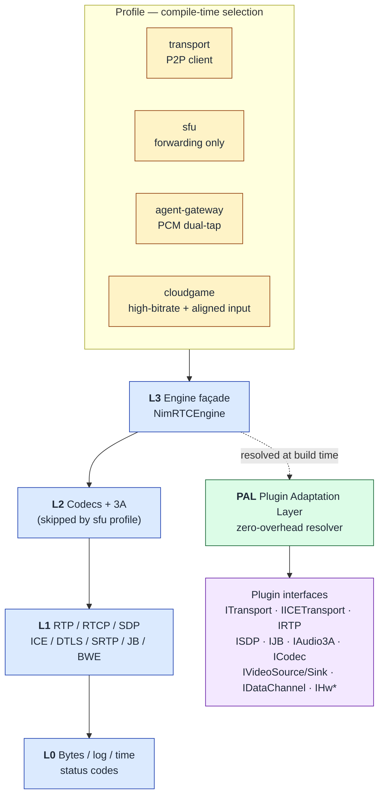

# NimRTC

[](LICENSE)
[](CHANGELOG.md)
[](https://en.cppreference.com/w/cpp/20)
[](#platform-support)
[](#build--ci)
[](CONTRIBUTING.md)

**A native C++ WebRTC alternative — embeddable, scene-assembled, swappable backends.**

One codebase that ships a P2P client, an SFU gateway, **and** runs on embedded Linux aarch64.
DTLS / RTP / 3A codecs are all pluggable; the crypto path can switch to Chinese national crypto (国密).

[Why NimRTC?](#why-nimrtc) · [Who is it for](#who-is-it-for) · [Quick Start](#quick-start) · [Architecture](#architecture-at-a-glance) · [Benchmarks](#benchmarks) · [Roadmap](#roadmap) · [FAQ](#faq)

🌐 **Other languages**: [简体中文](README.zh.md)

---

## TL;DR

- **What:** An embeddable C++20 media engine for real-time communication — a from-scratch WebRTC alternative, not a fork of libwebrtc.
- **Not:** A browser engine, a monolithic SDK, or a black-box crypto/codec stack.
- **Why it exists:** libwebrtc is large, hard to embed, and its crypto/codecs are opaque. NimRTC exposes the same wire-level interop with a layered, plugin-based architecture you can actually inspect, customize, and ship on aarch64.
- **Current state:** v0.10 Tech Preview — Chrome interop works on Windows, CI is green on Win/Linux x86_64/macOS arm64/Linux aarch64. Production-grade quality lands in P3/P4.

---

## Why NimRTC?

No single feature here is brand new — but the **combination** is rare in the open-source WebRTC ecosystem in 2026:

| # | Differentiator | Why it matters |
|---|---|---|
| 1 | **Layered design + Profile composition (L0–L3)** | Compile-time layer selection. The same source tree ships a full P2P client *and* an SFU gateway (SFU skips L2). LiveKit/mediasoup are server-only; libwebrtc is monolithic. |
| 2 | **Multi-platform CI green** | Windows, Linux x86_64, macOS arm64, Linux aarch64 — all four pass build + unit tests. See [Platform support](#platform-support). |
| 3 | **PAL (Plugin Adaptation Layer)** | All capability swapping flows through `pal::*` with **zero runtime overhead** and an unchanged public API. See [ADR-009](docs/adr/ADR-009-pal-slice-1.md). |
| 4 | **Swappable crypto backends** | DTLS backend can be replaced in-tree with OpenSSL / mbedTLS / 国密 (GMSSL, WoTrCrypt). Most OSS WebRTC stacks hard-wire their crypto. |
| 5 | **P2P client and SFU from the same codebase** | One set of plugin interfaces serves both. In 2026's OSS WebRTC ecosystem, this is rare. |

> **The plugin interfaces are the architectural seam.** They make the five points above work together. See [§ Plugin Architecture](#plugin-architecture) below.

---

## Who is it for?

| If you are… | NimRTC helps you… |
|---|---|
| Building a **P2P voice/video app** in C++ | Replace libwebrtc with something you can actually inspect, link statically, and ship at a few MB instead of hundreds. |
| Operating in a **信创 / 国密** regulated environment | Swap DTLS crypto to GMSSL without forking the engine. |
| Running on **embedded Linux aarch64** (Raspberry Pi, industrial SBCs, robotics) | Get real RTC on a constrained board with the same codebase that powers your desktop client. |
| Building **AI Agents / teleop / cloud gaming** | Use the dual PCM tap (pre/post-3A), strict-priority QoS, and ref_frame timeline APIs. |
| Standing up an **SFU** without rewriting protocol code | Compile the `sfu` profile (L0+L1+L3) — same engine, no L2 codec. |

> **Not a fit if:** you need a turnkey browser-grade SDK today, or you only target mobile (iOS/Android are roadmap, not P1).

---

## Quick Start

### Prerequisites

- **CMake ≥ 3.25**
- **MSVC 19.43+** (Windows 10/11) · **GCC 11+ / Clang 12+** (Linux) · **Apple Clang 15+** (macOS 14+)
- **Ninja** (recommended)
- **Python 3.8+** (for the e2e harness)

Verify your toolchain:

```bash
python tools/check_prerequisites.py
```

### Clone

```bash
git clone --recurse-submodules https://github.com/NimRTC/nimrtc.git
cd nimrtc
```

### Build (Option A — interactive scripts)

```bat
:: Windows
.\scripts\build.bat
.\scripts\build.bat --release     :: Release config
```

```bash
# Linux / macOS
bash scripts/build.sh
bash scripts/build.sh --preset=release
```

### Build (Option B — manual CMake)

```bash
cmake --preset debug            # or: debug.msvc, debug, release, release.aarch64
cmake --build build --config Debug -j
```

> **Preset reference:** see [`CMakePresets.json`](CMakePresets.json). The `dev.*` presets are hidden and inherited by visible ones; use `debug.msvc` / `release.msvc` / `debug.aarch64` / `release.aarch64` etc.

### Run tests

```bash
ctest --preset tests --output-on-failure
```

### Run the loopback-p2p smoke test

Two in-process agents handshake over real UDP — no signaling server needed.

```bash
cmake -B build -DNIMRTC_BUILD_EXAMPLES=ON -DCMAKE_BUILD_TYPE=Debug
cmake --build build --target loopback-p2p
./build/examples/Debug/loopback-p2p        # or .exe on Windows
```

### Run the Chrome interop acceptance suite

```bash
python tools/run_e2e_acceptance.py
ls build/e2e/        # artifacts land here
```

> **First-build note:** all third-party deps are managed via git submodules + SHA-pinned `src/third_party/vendor.json`. The `--recurse-submodules` flag on clone handles this.

---

## Architecture at a glance



Layers are **compile-time selected**, not runtime dispatched. The `sfu` profile literally omits L2 from the build, producing a smaller, simpler binary. Rendered natively by GitHub — no extra files needed.

Detailed design: [`docs/zh/architecture.md`](docs/zh/architecture.md) (canonical, Chinese) · see ADR-012 for the docs-layout decision. English technical deep-dives are on the roadmap.

---

## Benchmarks

The headline reason to choose NimRTC over libwebrtc is **size** — both binary footprint and source-tree complexity.

### Binary size (Windows x86_64, MSVC, Release)

| Artifact | NimRTC | libwebrtc (reference) |
|---|---|---|
| Static lib `nimrtc_engine` | **5.63 MB** | 150–250 MB |
| Example `loopback-p2p` (full client) | **6.61 MB** | 50–80 MB (typical WebRTC sample) |
| Example `demo-p2p` | **6.66 MB** | — |
| **Estimated static-link footprint** | **~15.5 MB** | **~100 MB minimum** |

> Measured on: Windows 10 x86_64, MSVC, Release. Run `python tools/benchmark_size.py build --markdown` to re-measure after any build or option change.

### Source-tree complexity

| Project | Source LoC | Languages |
|---|---|---|
| **NimRTC** | ~30 K (incl. vendored) | C++20 only |
| libwebrtc | ~5.5 M | C++ (mixed C++03/11/14/17) + internal bindings |

> Source-LoC numbers are rough, measured via `cloc` excluding vendored dependencies. libwebrtc's number is widely cited and varies by platform/branch.

### What this means in practice

- **Embeddable** — NimRTC links into your host app at a few MB instead of pulling in a 100+ MB blob.
- **Inspectable** — You can `grep` the entire engine source tree. Auditing a security fix or a regulatory review against libwebrtc is impractical.
- **Buildable on a laptop** — NimRTC builds end-to-end in minutes on commodity hardware. libwebrtc's source fetch alone is GB-scale.
- **Embedded-friendly** — On aarch64 with `-Os`, NimRTC's link footprint drops further; libwebrtc's is rarely deployed outside x86_64 / arm64 servers.

### Caveats

- libwebrtc numbers are **public reference values** that vary by platform, branch, and codec set. Re-validate before publishing marketing claims.
- NimRTC numbers depend on which plugins / codecs you build (`-DNIMRTC_PLUGINS_NVENC=ON` etc.). Run `benchmark_size.py` after any option change.
- **Throughput, latency, jitter, MOS scores are intentionally not in this section** — those depend heavily on platform, codec choice, network, and target use case. We will publish profile-specific benchmarks once P2 (PCM tap) and P3 (BWE + ref_frame) land.

See [`tools/benchmark_size.py`](tools/benchmark_size.py) for the measurement tool.

---

## Plugin Architecture

NimRTC exposes nearly every "swappable" capability through plugin interfaces defined in [`src/plugins/include/nimrtc/plugins/*.hpp`](src/plugins/include/nimrtc/plugins/) ([ADR-001](docs/adr/ADR-001-plugin-system.md)). The engine resolves them through PAL ([ADR-009](docs/adr/ADR-009-pal-slice-1.md)).

| Aspect | Value of explicit plugin interfaces | Cost of *not* having them |
|---|---|---|
| **Backend swapping** | ICE ↔ QUIC transport, RTP debugger, 3A bypass — same engine code | Each backend forks the engine → OCP violations |
| **Test isolation** | `MockTransport` / `NullAudio3A` / `CountingJitterBuffer` injected, no mock framework needed | gmock/virtual mocks leak into production code |
| **Enterprise customisation** | 国密 DTLS, 3A bypass, SLA instrumentation — compile-time plugin swap, single trunk | Forks drift, `#ifdef` becomes unmaintainable |
| **Third-party ecosystem** | Write `MyAudio3A : plugins::IAudio3A`, link with `-DNIMRTC_MODULE_AUDIO3A=MyAudio3A` | Users must `#include <nimrtc/audio3a/...>` — encapsulation breaks |
| **Failure-domain isolation** | Plugin interface status codes are the contract | Errors propagate inconsistently across modules |

**Comparison baseline:** GStreamer / FFmpeg / OBS / PipeWire all use plugin architectures — but in the **WebRTC** ecosystem (libwebrtc / Pion / LiveKit / mediasoup / janus), only Pion and libwebrtc internally have similar abstractions. **NimRTC exposes them publicly and runs both P2P and SFU on the same set of interfaces.**

Plugins are the evolution mechanism: P0–P1 use built-in implementations; P2–P3 differentiating features (dual 3A tap, strict-priority QoS, ref_frame timeline) also ship as plugins (`IJB::set_render_delivered`, `IRTP::set_ref_frame`).

---

## Profiles

Profiles are **compile-time configurations**, not runtime dispatch. Format: see [ADR-010](docs/adr/ADR-010-profile-json-format.md) (JSON is the first-party format).

| Profile | Layers | Use case |
|---|---|---|
| `transport` | L0+L1+L2+L3 | Full P2P client (Chrome interop) |
| `sfu` | L0+L1+L3 (**skips L2**) | Server-side forwarding without re-encoding |
| `agent-gateway` | L0+L1+L2 (tap enabled) | AI Agent ingress — dual PCM tap + 3A bypass |
| `cloudgame` | L0+L1+L2+L3 (high-bitrate main + input/render alignment) | Teleop / cloud gaming (long-term candidate) |

---

## Differentiated capabilities (for AI Agent / teleop / embedded)

These are **P2 / P3 targets**, not P0 features — listed here so you can plan ahead.

| Need | NimRTC differentiation | Status in current OSS WebRTC |
|---|---|---|
| **3A bypass** — Agent feeds PCM to ASR | `pre-3a / post-3a` dual PCM tap | WebRTC APM is opaque; no PCM mid-pipeline hook |
| **Control messages never starved by video** — teleop commands must not drop | Strict-priority scheduling contract | DTLS-SCTP / DataChannel is best-effort only |
| **Capture-to-decision alignment** — Agent decisions tied to video frames | `ref_frame` timeline API | libwebrtc has no such abstraction; apps must build their own |

---

## Roadmap (P1–P4, condensed)

- **P1 — Transport MVP:** Chrome ↔ NimRTC P2P A/V interop; vendored libsrtp + libopus + mbedTLS + WebRTC APM.
  - *Note:* aarch64 *compiles* green ≠ *interops* green (see architecture doc §13.1).
- **P2 — Scene differentiation:** dual pre/post-3A PCM tap; strict-priority QoS; usrsctp DataChannel interop; first Profile library.
- **P3 — Client quality + ref_frame:** adaptive JB + Goog-CC-style BWE; complete ref_frame timeline; first paid reference customer.
- **P4 — Production + 国密 enterprise:** dual-link / takeover framework (enterprise); GMSSL crypto backend live; first commercial contract.

Full roadmap: [`docs/zh/architecture.md`](docs/zh/architecture.md) §13.

---

## Current progress (v0.10.0 Tech Preview)

| Item | Status | Version |
|---|---|---|
| v0.10 design + ADR decisions landed | ✅ Done | v0.10 |
| Scaffolding (CMake / CI / vendor) | ✅ Done | v0.9.2 |
| Vendored libs (wolfSSL / libsrtp / libopus / libjuice / WebRTC APM) | ✅ Done | v0.9.2 |
| Chrome ↔ NimRTC P2P A/V interop (Case D) | ✅ Done | v0.9.2 |
| 4-platform CI green (Win / Linux x86_64 / macOS arm64 / Linux aarch64) | ✅ Done | v0.9.2 |
| RFC 7587 Opus packetise/depacketise complete | ✅ Done | v0.9.2 |
| PAL Slice 1 (Plugin Adaptation Layer) | ✅ Done | v0.10 |
| H.264 HW backends (NVENC / AMF / QSV / DXVA / VA-API / OpenH264) | ✅ Done | v0.9.2 |
| ADR-009 / 010 / 011 / 012 decisions landed | ✅ Done | v0.10 |

> v0.10 closes v0.9 wrap-up and lands the PAL Slice 1 refactor. P2 content (DataChannel interop, SFU relay, PCM tap, official Profile library) is queued for v0.11.0.

---

## Platform support

| Platform | Arch | Status |
|---|---|---|
| Windows | x86_64 | ✅ Supported |
| Linux | x86_64 | ✅ Supported |
| macOS | arm64 | ✅ Supported |
| Linux | aarch64 | ✅ Supported (compile-green; deployment validate on target hardware) |

Details in [CHANGELOG](CHANGELOG.md) "Platform support matrix".

---

## Build & CI

### CMake options

| Option | Default | Effect |
|---|---|---|
| `NIMRTC_BUILD_TESTS` | **ON** | Build gtest unit tests |
| `NIMRTC_BUILD_EXAMPLES` | OFF | Build the `loopback-p2p` smoke example |
| `NIMRTC_BUILD_DOCS` | OFF | Build Doxygen API docs |
| `NIMRTC_VENDORED` | **ON** | Use vendored `src/third_party/*` libraries |
| `NIMRTC_ASAN` | OFF | AddressSanitizer (Debug + GCC/Clang/MSVC ≥ 2019) |
| `NIMRTC_UBSAN` | OFF | UndefinedBehaviorSanitizer |
| `NIMRTC_WARNINGS_AS_ERRORS` | **ON** | Treat warnings as errors |
| `NIMRTC_VENDORED_WEBRTC_APM` | **ON** | Use vendored WebRTC APM library |
| `NIMRTC_PLUGINS_NVENC` | OFF | NVIDIA NVENC + NVDEC (Win/Linux) |
| `NIMRTC_PLUGINS_AMF` | OFF | AMD AMF (Windows) |
| `NIMRTC_PLUGINS_QSV` | OFF | Intel QSV via libvpl/oneVPL |
| `NIMRTC_PLUGINS_DXVA` | OFF | Microsoft DXVA/MF (Windows) |
| `NIMRTC_PLUGINS_VAAPI` | OFF | Linux VA-API |
| `NIMRTC_PLUGINS_OPENH264` | OFF | OpenH264 software fallback |

### Repository layout

```
nimrtc/
├── CMakeLists.txt             # Root CMake (C++20, options above)
├── CMakePresets.json          # Presets: dev, debug, release, asan, ci.{linux,windows,macos}
├── docs/                      # Technical doc (zh/en), ADRs, security notes
├── examples/
│   └── loopback-p2p/          # Two-agent ICE handshake smoke test
├── src/
│   ├── core/                  # bytes.hpp, log, time, status codes (L0)
│   ├── engine/                # NimRTCEngine façade (top-level entry)
│   ├── modules/{ice,sdp,rtp,srtp,jb,audio3a}/
│   ├── plugins/               # Public plugin interfaces (ADR-001)
│   └── third_party/           # Vendored: libjuice, libsrtp, mbedtls, libopus
├── tests/                     # Cross-module gtest integration tests
├── interop/                   # Chrome / Firefox baseline interop harness
├── cmake/                     # Shared CMake helpers
├── tools/                     # Vendor scripts, fuzzers, profiling helpers
└── .github/workflows/ci.yml   # CI matrix
```

### Vendored third-party versions

Pinned in [`src/third_party/vendor.json`](src/third_party/vendor.json) (SHA-verified):

| Library | Version | Submodule path |
|---|---|---|
| `wolfssl` | v5.9.2 | `src/third_party/wolfssl/src` |
| `libopus` | v1.6.1 | `src/third_party/libopus/src` |
| `libjuice` | master | `src/third_party/libjuice/src` |
| `libsrtp` | master | `src/third_party/libsrtp/src` |
| `webrtc_audio_processing` | master | `src/third_party/webrtc_audio_processing/src` |
| `googletest` | v1.12.1 | `src/third_party/googletest/src` |

---

## FAQ

### "Could not find Ninja"

```bash
# Ubuntu / Debian
sudo apt install ninja-build
# Fedora / RHEL
sudo dnf install ninja-build
# macOS
brew install ninja
# Windows (Chocolatey)
choco install ninja
```

### MSVC errors "MSB8020" / "v143 not found"

You're in a non-VS-2022 Developer Prompt. Open **"x64 Native Tools Command Prompt for VS 2022"** and reconfigure.

### "WebRTC APM pre-built library not found"

Skip 3A entirely:

```bash
cmake --preset dev -DNIMRTC_VENDORED_WEBRTC_APM=OFF
```

Or fetch the prebuilt:

```bash
python tools/fetch_webrtc_apm.py
cmake --build build
```

### GCC too old for `-std=c++20`

| Distro | Default GCC | Upgrade |
|---|---|---|
| Ubuntu 20.04 / Debian 11 | GCC 9–10 | `sudo apt install gcc-11 g++-11 && export CC=gcc-11 CXX=g++-11` |
| Ubuntu 22.04 / Debian 12 | GCC 11–12 | ✅ Use as-is |
| Fedora 36+ | GCC 12+ | ✅ Use as-is |
| RHEL / Rocky 8 | GCC 8 | `sudo dnf install gcc-toolset-11 && source /opt/rh/gcc-toolset-11/enable` |
| CentOS 7 | GCC 4.8 | ❌ Not supported — upgrade OS or use a container |
| Arch Linux | GCC 13+ | ✅ Use as-is |
| macOS | Apple Clang | Xcode ≥ 15 required (`clang++ --version` to check) |

### Linker errors / "undefined reference"

1. Submodules not initialised — `git submodule update --init --recursive`
2. Compiler < GCC 11 — see table above
3. Stale build cache — `rm -rf build && cmake --preset dev && cmake --build build -j`

### How do I verify my toolchain without running CMake?

```bash
python tools/check_prerequisites.py             # full check
python tools/check_prerequisites.py --compiler  # compiler only
```

---

## Documentation & language notes

- **Canonical technical doc:** [`docs/zh/architecture.md`](docs/zh/architecture.md) (Chinese — see [ADR-012](docs/adr/ADR-012-zh-docs-layout.md)).
- **Architecture decisions:** [`docs/adr/`](docs/adr/) (Chinese summaries, code/identifiers in English).
- **English deep-dives:** roadmap item for v1.0+.
- **Standalone docs site:** docs-zh.nimrtc.dev, planned for v1.0+.

---

## Contributing & governance

- **Issues:** bugs, feature requests, interop compatibility feedback — preferred channel.
- **Pull Requests:** read [`CONTRIBUTING.md`](CONTRIBUTING.md); commits must be DCO-signed (`git commit -s`). No CLA.
- **Interop CI:** the `interop/` directory runs continuously. Chrome (pinned stable) and Firefox (pinned stable) are the baseline matrix.
- **Security:** private channel — see [`SECURITY.md`](SECURITY.md).
- **Vendoring policy:** crypto / codecs / SCTP / 3A are vendored; RTP / RTCP / SDP / JB / BWE / ICE state machines / timeline scheduling are written in-house. See [`docs/zh/architecture.md`](docs/zh/architecture.md) §11.
- **End-to-end acceptance standards:** [ADR-011](docs/adr/ADR-011-teleop-metrics-caliber.md) clarifies that the engine carries only single-hop budget; DB31/T 1505-2024 / T/SSITS 2003-2023 are the integrator's responsibility.

---

## License

- **Project:** [Apache-2.0](LICENSE)
- **Third-party:** see [`NOTICE`](NOTICE) and [`docs/zh/architecture.md`](docs/zh/architecture.md) §11.
