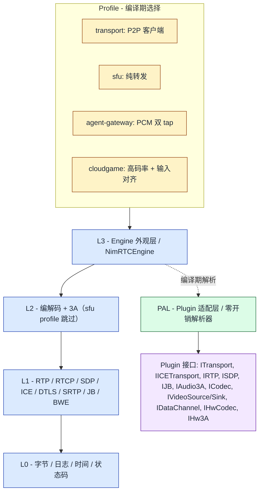

# NimRTC

[](LICENSE)
[](CHANGELOG.md)
[](https://en.cppreference.com/w/cpp/20)
[](#平台支持)
[](#构建--ci)
[](CONTRIBUTING.md)

> **当前版本**：v0.10.3 技术预览版 — Chrome ↔ NimRTC P2P 音视频互通已在 Windows 上验证。
> 见 [当前进度](#当前进度v0100-技术预览版) 看今天能做什么；[路线图](#路线图p1p4-简化版) 看下一步。
>
> 📖 **本文档为英文 README 的中文版本**。技术 canonical 文档以 [`docs/zh/architecture.md`](docs/zh/architecture.md) 为准（ADR-012）。中文 README 与英文 README 内容同步维护。

---

**原生 C++ WebRTC 替代实现 —— 可嵌入、场景化组装、后端可替换。**

一份源码同时产出 **P2P 客户端**、**SFU 网关**，并能在 **嵌入式 Linux aarch64** 上跑。
DTLS / RTP / 3A 后端均通过 plugin 接口暴露，加密路径可切换到 **GMSSL**，在 GM/T 合规场景里
不 fork 主干。

[为什么选 NimRTC？](#为什么选-nimrtc) · [适用人群](#适用人群) · [快速上手](#快速上手) · [Hello, World](#hello-world) · [架构概览](#架构概览) · [基准数据](#基准数据) · [路线图](#路线图) · [常见问题](#常见问题)

---

## 为什么是现在？

WebRTC 在演进，但主流实现没跟上。

- **libwebrtc** 是事实标准引擎，但构建产物多 GB、加密和编解码都是黑盒、代码库是 monolithic 的。
  把 libwebrtc 嵌到 aarch64 上，或者按 GM/T 合规要求去做审计，本身就是一场苦修。
- **AI Agent / 遥操作 / 云游戏**需要 libwebrtc 不暴露的能力 —— pre/post-3A PCM tap、严格优先级的控制面、采集-决策帧对齐 API。
- **信创 / 合规**环境要的是"换路径"而不是"fork 主干"的国密落地方式。

NimRTC 是从零用 C++20 写的实现：保留你需要的**线缆级互通**（Chrome、Firefox、libwebrtc 节点），
把不透明的单体替换成**编译期分层 + plugin 适配**的引擎，可读、可换、可上 aarch64。

---

## 一句话总结

- **是什么**：一个可嵌入的 C++20 媒体引擎，从零开始实现的 WebRTC 替代品，**不是** libwebrtc 的 fork。
- **存在的原因**：libwebrtc 体积庞大、难以嵌入、加密和编解码不透明。NimRTC 保留同等级协议兼容性的同时，把 monolith 替换成分层 + plugin 适配的引擎，可被检查、可被定制、可被部署在 aarch64 上。
- **当前状态**：v0.10.3 技术预览版，Chrome ↔ NimRTC P2P 音视频互通已在 Windows 上验证通过；CI 在 Windows / Linux x86_64 / macOS arm64 / Linux aarch64 四平台均为绿色。生产级别质量在 P3 / P4 落地。

---

## 特性一览

| | | |
|---|---|---|
| 🎯 **编译期分层（L0–L3）** | 🔌 **公开 plugin 接口** | 🪶 **~5.6 MB 静态库**（libwebrtc 150–250 MB）|
| 🧩 **面向场景的 Profile，不 fork 主干** —— `transport` / `sfu` / `agent-gateway` / `cloudgame` | 🔁 **加密后端可替换** —— OpenSSL ↔ mbedTLS ↔ GMSSL，API 不变 | 🛡️ **GM/T 国密就绪** —— 信创合规场景有可信落地路径 |
| 📡 **线缆级互通** —— Chrome ↔ Firefox ↔ libwebrtc | 🏗️ **四平台 CI** —— Win / Linux x86_64 / macOS arm64 / Linux aarch64 | 🎛️ **面向 AI Agent 的差异化** —— pre/post-3A PCM tap、ref_frame 时间线 |

---

## 为什么选 NimRTC？

下面这些**单点都不新**，但**组合在一起**在 2026 年的开源 WebRTC 生态里是少见的：

| # | 差异化点 | 为什么重要 |
|---|---|---|
| 1 | **分层 + Profile 组装（L0–L3）** | 编译期选层。同一份代码既能发 P2P 客户端，也能发 SFU 网关（SFU 直接跳过 L2）。LiveKit/mediasoup 只做服务端；libwebrtc 是 monolithic。 |
| 2 | **多平台 CI 全部绿色** | Windows / Linux x86_64 / macOS arm64 / Linux aarch64 四平台均通过构建+单测。详见[平台支持](#平台支持)。 |
| 3 | **PAL（Plugin Adaptation Layer）** | 所有能力切换走 `pal::*`，**零运行时开销**，公共 API 不变。详见 [ADR-009](docs/adr/ADR-009-pal-slice-1.md)。 |
| 4 | **加密后端可替换** | DTLS 后端可在同一 codebase 内替换为 OpenSSL / mbedTLS / 国密（GMSSL、WoTrCrypt）。多数开源 WebRTC 栈把加密焊死。 |
| 5 | **P2P 客户端和 SFU 同一 codebase** | 同一套 plugin 接口同时支撑两条产品线。2026 年的开源 WebRTC 生态里几乎找不到第二家。 |

> **plugin 接口是这套架构的"接缝"**。上面五点要组合起来才出差异化，详见 [§ plugin 架构](#plugin-架构)。

---

## 适用人群

| 如果你是… | NimRTC 能帮你… |
|---|---|
| 用 C++ 写 P2P 语音/视频应用 | 用一个真正能 `grep`、能静态链接、几个 MB 就够的引擎替代 libwebrtc。 |
| 政企信创 / 国密合规环境 | 不 fork 主干就把 DTLS 加密切换到 GMSSL。 |
| 在嵌入式 Linux aarch64 上跑 | Raspberry Pi、工业 SBC、机器人主控 —— 同一 codebase，桌面端能用的能力嵌入式也能用。 |
| 搭 AI Agent / 遥操作 / 云游戏 | 用 pre/post-3A 双 PCM tap、严格优先级 QoS、ref_frame 时间线 API。 |
| 自建 SFU 但不想重写协议栈 | 编译 `sfu` profile（L0+L1+L3），同一套引擎，跳过 L2 codec。 |

> **不适用的场景**：今天就要一个开箱即用的浏览器级 SDK；只做移动端（iOS/Android 在路线图，不在 P1）。

---

## 快速上手

### 前置依赖

- **CMake ≥ 3.25**
- **MSVC 19.43+**（Windows 10/11）· **GCC 11+ / Clang 12+**（Linux）· **Apple Clang 15+**（macOS 14+）
- **Ninja**（推荐）
- **Python 3.8+**（e2e 自动化需要）

校验工具链：

```bash
python tools/check_prerequisites.py
```

### Clone

```bash
git clone --recurse-submodules https://github.com/NimRTC/nimrtc.git
cd nimrtc
```

### 构建（A：交互脚本）

```bat
:: Windows
.\scripts\build.bat
.\scripts\build.bat --release     :: Release 配置
```

```bash
# Linux / macOS
bash scripts/build.sh
bash scripts/build.sh --preset=release
```

### 构建（B：手动 CMake）

```bash
cmake --preset debug            # 可选：debug.msvc / release.msvc / debug.aarch64 等
cmake --build build --config Debug -j
```

> **预设说明**：详见 [`CMakePresets.json`](CMakePresets.json)。`dev.*` 系列为 hidden 父预设，命令行请用可见预设（`debug.msvc` / `release.msvc` / `debug.aarch64` 等）。

### 跑测试

```bash
ctest --preset tests --output-on-failure
```

### 跑 loopback-p2p 冒烟测试

两个进程内 agent 通过真实 UDP 握手，不需要信令服务器。

```bash
cmake -B build -DNIMRTC_BUILD_EXAMPLES=ON -DCMAKE_BUILD_TYPE=Debug
cmake --build build --target loopback-p2p
./build/examples/Debug/loopback-p2p        # Windows 下加 .exe
```

### 跑 Chrome 互通验收

```bash
python tools/run_e2e_acceptance.py
ls build/e2e/        # 产物落地路径
```

> **首次构建提示**：所有第三方依赖通过 git submodule + SHA 锁定（`src/third_party/vendor.json`），clone 时加 `--recurse-submodules` 一并拉取。

---

## Hello, World

两个 engine 走完 SDP 协商，在 loopback 接口上跑通 ICE 连通性检查，最终双双进入 `connected`
—— **~30 行 C++**。这就是 `examples/loopback-p2p/` 里的同款代码路径：

```cpp
#include <nimrtc/engine/engine.hpp>
#include <thread>
#include <chrono>

using namespace nimrtc::engine;
using namespace std::chrono_literals;

int main() {
    EngineConfig cfg;
    cfg.local_bind_address    = "127.0.0.1";
    cfg.local_port_range_begin = 51000;
    cfg.local_port_range_end   = 51099;
    cfg.pcm_sample_rate_hz     = 48000;
    cfg.pcm_channels           = 1;

    // Offerer（CONTROLLING）
    NimRTCEngine A(cfg);
    A.pre_open();
    A.open();
    auto offer = A.create_offer();

    // Answerer（CONTROLLED）—— 先塞远端 ICE，让 libjuice 选对角色
    NimRTCEngine B(cfg);
    B.pre_open();
    B.set_remote_ice(extract_ice_block(offer));   // 辅助函数，参考 examples/
    B.open();
    auto answer = B.process_remote_sdp(offer);

    A.process_remote_sdp(*answer);

    // 双边 tick，直到 ICE 都连通
    while (A.ice_state_string() != "connected" || B.ice_state_string() != "connected") {
        A.tick();
        B.tick();
        std::this_thread::sleep_for(10ms);
    }
    return 0;
}
```

三件事值得注意：

1. **没有 mock 对象、没有测试框架** —— engine 通过真实 UDP 在 `127.0.0.1` 上跟自己握手。
   你应用里用的就是这个 `NimRTCEngine`，没有"另一套测试 API"。
2. **DTLS / SRTP / RTP / 抖动缓冲 / ICE** 都在 `tick()` 内部处理，用户代码看不到任何协议状态。
3. **plugin 接口不会泄漏到应用层**。后续要把 mbedTLS 换成 GMSSL，或把自研 3A 换成 HW 后端，
   上面这段代码**不需要改**。

完整源码：[`examples/loopback-p2p/loopback-p2p.cpp`](examples/loopback-p2p/loopback-p2p.cpp)。
Chrome 互通（Chrome 出 offer，NimRTC 出 answer，SDP↔ICE 手动桥接）见 [`interop/`](interop/)
和 [`tools/run_e2e_acceptance.py`](tools/run_e2e_acceptance.py)。

---

## 架构概览

NimRTC 是 **L0–L3 四层编译期叠加 PAL（Plugin Adaptation Layer）**。**Profile** 也是编译期决定
哪些层会被链接进二进制——同一份源码既能产出 P2P 客户端，又能产出 SFU 网关，原理就在这里。

### 分层一览

```
            ┌──────────────────────────────────────────────────┐
            │  PROFILE  ——  编译期选择                          │
            │  transport（P2P）│ sfu │ agent-gateway │ cloudgame │
            └──────────────────────────────────────────────────┘
                                    │
                                    ▼
            ┌──────────────────────────────────────────────────┐
            │  L3  Engine 外观层                                │
            │  NimRTCEngine 把所选 profile + plugin 串起来       │
            └──────────────────────────────────────────────────┘
                                    │
                                    ▼
            ┌──────────────────────────────────────────────────┐
            │  L2  编解码 + 3A         （sfu profile 跳过）     │
            │  Opus / G.711 / VP8 / H.264 · 音频 3A 流水线      │
            └──────────────────────────────────────────────────┘
                                    │
                                    ▼
            ┌──────────────────────────────────────────────────┐
            │  L1  协议 / 状态机                                │
            │  RTP · RTCP · SDP · ICE · DTLS · SRTP · JB · BWE  │
            └──────────────────────────────────────────────────┘
                                    │
                                    ▼
            ┌──────────────────────────────────────────────────┐
            │  L0  原语                                          │
            │  字节 · 日志 · 时间 · 状态码                        │
            └──────────────────────────────────────────────────┘

       ┌──────────────────────────────────────────────────────┐
       │  PAL  ——  Plugin 适配层                              │
       │  每个能力都在编译期解析完，零运行期间接，公开 API 不变 │
       └──────────────────────────────────────────────────────┘
                                    │
                                    ▼
       ┌──────────────────────────────────────────────────────┐
       │  PLUGIN 接口  （header-only，在 `src/plugins/`）       │
       │                                                       │
       │  ITransport · IICETransport · IRTP · ISDP · IJB       │
       │  IAudio3A · ICodec                                    │
       │  IVideoSource · IVideoSink · IDataChannel             │
       │  IHwCodec · IHw3A                                     │
       └──────────────────────────────────────────────────────┘
```

GitHub 原生渲染版本：



### 各层职责

| 层 | 所在位置 | 职责 |
|---|---|---|
| **Profile** | `cmake/profiles/*.cmake` | 纯构建期选择：决定 L0–L3 哪些被链接、Plugin 走哪一套后端。**没有运行期分发**——选 `sfu` 就是在构建时把 L2 整个砍掉。 |
| **L3 Engine** | `src/engine/` | 唯一对外门面（`NimRTCEngine`）。把 Plugin 串起来；公开 API 里**不出现任何具体模块头文件**——见 [`ARCHITECTURE.md`](ARCHITECTURE.md) 的 Layout Invariant 4。 |
| **L2 编解码 + 3A** | `src/modules/opus/`、`…/audio3a/`、`…/video_payload/` | 编解码与音频 3A 流水线。`sfu` profile 不编 L2，二进制里编码面直接砍半。 |
| **L1 协议 / 状态机** | `src/modules/{rtp,sdp,ice,dtls,srtp,jb,bwe}/` | 真正跟网络打交道的那一层。按 §11 vendoring 规则**自研**，不引入第三方协议栈。 |
| **L0 原语** | `src/core/`、`src/log/` | 状态码、字节缓冲、单调时钟、日志。能 header-only 就 header-only。 |
| **PAL** | `src/plugins/pal/` | 用一个小注册表把每个 Plugin 能力在编译期解析完；解析之后调用是直接的，零间接，对 Engine 来说公开 API 完全不变。见 [ADR-009](docs/adr/ADR-009-pal-slice-1.md)。 |
| **Plugin 接口** | `src/plugins/` | Header-only 的抽象基类——这就是那道**缝**。OpenSSL ↔ mbedTLS ↔ GMSSL、自研 ↔ HW 3A、libjuice ↔ 自研 ICE，全部通过这一层接口替换。 |

### 数据流（一段话版）

一帧从 `IVideoSource`（或麦克风采集）进来，L1 做 RTP 打包，下到 `ITransport`，由
`IDTLS`/`ISRTP` 在线缆上做保护。接收端走反方向：`ITransport` → 抖动缓冲（`IJB`）→ L2 解码
→ 音频 3A（`IAudio3A`）→ `IVideoSink` / 音频渲染。BWE 通过 RTCP 回环收紧带宽估计。L0 之上
的全部都能通过 Plugin 接口替换——所以不 fork 就能切到 GMSSL 或 HW 3A 后端，改一个 CMake
选项即可。

详细设计：见 [`docs/zh/architecture.md`](docs/zh/architecture.md)（canonical，中文）。

---

## 基准数据

选 NimRTC 而不是 libwebrtc 的头号理由是**体积**——二进制 footprint 和源码复杂度。

### 二进制体积（Windows x86_64，MSVC，Release）

| 产物 | NimRTC | libwebrtc（参考） |
|---|---|---|
| 静态库 `nimrtc_engine` | **5.63 MB** | 150–250 MB |
| 示例 `loopback-p2p`（完整客户端） | **6.61 MB** | 50–80 MB（典型 WebRTC sample） |
| 示例 `demo-p2p` | **6.66 MB** | — |
| **预估静态链接 footprint** | **~15.5 MB** | **~100 MB 起** |

> 实测环境：Windows 10 x86_64，MSVC，Release。改构建选项后跑 `python tools/benchmark_size.py build --markdown` 更新。

本地复现：

```bash
cmake --preset release.msvc -DNIMRTC_BUILD_EXAMPLES=ON
cmake --build build --config Release -j
python tools/benchmark_size.py build --markdown   # 可直接粘贴 README 的表格
```

### 源码规模

| 项目 | 源码行数 | 主语言 |
|---|---|---|
| **NimRTC** | ~30 K（含 vendored） | C++20 |
| libwebrtc | ~5.5 M | C++（混 C++03/11/14/17）+ 内部绑定 |

> 行数通过 `cloc` 估算（不含 vendored 依赖）。libwebrtc 的数字是广泛引用的公开估值，会随平台 / branch 浮动。

### 这意味着什么

- **可嵌入** —— 链接进你的宿主应用只需几 MB，而不是 100+ MB 的整块。
- **可审查** —— 整个引擎源码可以 `grep` 通。安全修复、等保评审、合规审计对比 libwebrtc 是可完成的。
- **笔记本能构建** —— NimRTC 全量构建在普通笔记本上几分钟。libwebrtc 仅源码拉取就要 GB 级。
- **嵌入式友好** —— aarch64 加 `-Os` 后链接 footprint 更小；libwebrtc 几乎只部署在 x86_64 / arm64 服务器上。

### 注意事项

- libwebrtc 数字是**公开参考值**，随平台、branch、codec 集合浮动，发布营销文案前请重新验证。
- NimRTC 数字取决于构建选项（`-DNIMRTC_PLUGINS_NVENC=ON` 等）。每次改选项都跑一遍 `benchmark_size.py`。
- **吞吐量 / 延迟 / 抖动 / MOS 评分本节故意不放** —— 这些指标依赖平台、codec、网络、目标场景。等 P2（PCM tap）和 P3（BWE + ref_frame）落地后再发布 profile 专属 benchmark。

详见 [`tools/benchmark_size.py`](tools/benchmark_size.py)。

---

## plugin 架构

NimRTC 几乎所有"可替换"的能力都通过 plugin 接口暴露（[`src/plugins/include/nimrtc/plugins/*.hpp`](src/plugins/include/nimrtc/plugins/)，[ADR-001](docs/adr/ADR-001-plugin-system.md)）。Engine 通过 PAL（[ADR-009](docs/adr/ADR-009-pal-slice-1.md)）解析。

| 维度 | 显式 plugin 接口的价值 | 不做 plugin 接口的代价 |
|---|---|---|
| **后端替换** | ICE ↔ QUIC transport、RTP 调试器、3A 旁路 —— 同一份 engine 代码切换 | 每个后端都要 fork engine，违反 OCP |
| **测试隔离** | 测试用 `MockTransport` / `NullAudio3A` / `CountingJitterBuffer` 注入，不需要 mock framework | gmock / virtual mock 类污染生产代码 |
| **企业版插桩** | 国密 DTLS、3A 旁路、SLA 监控 —— 企版编译时**仅替换 plugin 实现**，核心仓主干不分裂 | 企版 fork 主干（漂移）或 `#ifdef`（不可维护） |
| **第三方生态** | 写 `MyAudio3A : plugins::IAudio3A`，`-DNIMRTC_MODULE_AUDIO3A=MyAudio3A` 注入 | 用户必须 `#include <nimrtc/audio3a/...>` 才能扩展，破坏封装 |
| **故障域隔离** | plugin 接口 status code 是契约 | 错误码五花八门，跨模块失败原因追踪极其痛苦 |

**对比基线**：GStreamer / FFmpeg / OBS / PipeWire 都用 plugin 架构，但那是多媒体生态；**WebRTC 生态**里（libwebrtc / Pion / LiveKit / mediasoup / janus）只有 Pion 和 libwebrtc 内部有类似抽象。**NimRTC 把 plugin 接口公开，且让 P2P 客户端和 SFU 跑在同一套接口上**——2026 年的开源 WebRTC 生态里几乎找不到第二家。

Plugin 是 NimRTC **可演进性**的核心机制：P0–P1 用内置实现，P2–P3 引入的差异化能力（双 3A tap、严格优先级、ref_frame）也以 plugin 形式呈现（P2 `IJB::set_render_delivered`、P3 `IRTP::set_ref_frame`）。

---

## 与同类项目的对比

给评估者的实用矩阵 —— 横向对比你关心的那几行：

| | **NimRTC** | **libwebrtc** | **Pion** | **mediasoup** | **LiveKit** |
|---|---|---|---|---|---|
| **语言** | C++20 | C++（混 C++03/17） | Go | C++ | Go |
| **同一 codebase 产出 P2P + SFU** | ✅ | ⚠️ libwebrtc + 独立 server | ❌ | ❌ 仅 SFU | ❌ 仅 SFU |
| **公开 plugin 接口** | ✅ 各层都有 | ❌ 内部封装 | ⚠️ 部分 | ⚠️ 服务端 | ⚠️ 服务端 |
| **静态链接 footprint** | **~5.6 MB** | 150–250 MB | 不适用（Go） | 服务端 | 服务端 |
| **嵌入式 Linux aarch64** | ✅ CI 绿色 | ⚠️ 久未维护的 port | ❌ | ❌ | ❌ |
| **GM/T 国密（GMSSL）后端切换** | ✅ plugin 切换，不 fork | ❌ 需打补丁重建 | ❌ | ❌ | ❌ |
| **AI Agent / 3A 旁路 hook** | ✅ `pre/post-3a` PCM tap（P2） | ❌ APM 黑盒 | ❌ | ❌ | ❌ |
| **ref_frame / 帧对齐时间线** | 🚧 P3 | ❌ | ❌ | ❌ | ❌ |
| **线缆级 Chrome 互通** | ✅ Case D 绿色 | ✅ | ✅（仅 Go） | ✅ 通过浏览器 SDK | ✅ 通过浏览器 SDK |
| **2026 生产成熟度** | Tech Preview | Production-grade | Production-grade | Production-grade | Production-grade |

**NimRTC 全面领先的领域**：aarch64 嵌入式、GM/T 国密、AI Agent hook、单主干 P2P+SFU。
**NimRTC 落后的领域**：生态广度、编解码覆盖、浏览器引擎对等、年限沉淀。**按需选择。**

---

## Profile

Profile 是**编译期配置**，不是运行时分发。声明式 JSON 格式见 [ADR-010](docs/adr/ADR-010-profile-json-format.md)。

| Profile | 包含层 | 用途 |
|---|---|---|
| `transport` | L0+L1+L2+L3 | 完整 P2P 客户端（Chrome 互通） |
| `sfu` | L0+L1+L3（**跳过 L2**）| 服务器转发，不重编解码 |
| `agent-gateway` | L0+L1+L2（tap 打开）| AI Agent 接入，PCM 双 tap + 3A 旁路 |
| `cloudgame` | L0+L1+L2+L3（高码率主线 + 输入渲染对齐）| 遥操作 / 云游戏（远期候选） |

---

## 差异化能力（针对 AI Agent / 遥操作 / 嵌入式）

这三项是 **P2 / P3 的目标交付**，不是 P0 已具备 —— 列在这里便于提前规划。

| 需求 | NimRTC 差异化 | 当前同类项目状态 |
|---|---|---|
| **3A 旁路**：Agent 需要把语音喂给 ASR | `pre-3a / post-3a` **双 PCM tap** 原语 | WebRTC APM 黑盒，PCM 中段无 hook |
| **控制消息不被视频挤占**：遥操作指令不能丢 | 严格优先级调度契约 | DTLS-SCTP / DataChannel 仅尽力而为 |
| **采集-决策对齐**：AI Agent 决策要与视频帧关联 | `ref_frame` 时间线 API | libwebrtc 无此抽象，application 层必须自建 |

---

## 路线图（P1–P4 简化版）

- **P1 传输 MVP**：Chrome ↔ NimRTC P2P 音视频互通；vendor libsrtp + libopus + mbedTLS + WebRTC APM。
  - *注意*：aarch64 **编译可过 ≠ 互通可过**（见 architecture §13.1）。
- **P2 场景差异化**：pre/post-3A 双 PCM tap；严格优先级调度；usrsctp DataChannel 互通；首批 Profile 库。
- **P3 客户端质量 + ref_frame**：自适应 JB + Goog-CC 风格 BWE；ref_frame 时间线完整实现；首个付费标杆客户。
- **P4 生产化 + 国密企版**：双链路 / 接管框架企版；国密后端落地；首份商业合同。

详细路线图：见 [`docs/zh/architecture.md`](docs/zh/architecture.md) §13。

---

## 当前进度（v0.10.3 技术预览版）

master 分支、`cmake --preset release.msvc` 出来后，今天能跑通的能力：

| 能力 | 状态 | 落地版本 |
|---|---|---|
| v0.10 设计 + ADR 决策落地（ADR-009 / 010 / 011 / 012） | ✅ | v0.10 |
| 脚手架 —— CMake、四平台 CI、vendored 依赖 | ✅ | v0.9.2 |
| 第三方库 vendor（wolfSSL / libsrtp / libopus / libjuice / WebRTC APM） | ✅ | v0.9.2 |
| Chrome ↔ NimRTC P2P 音视频互通（Case D，Windows） | ✅ | v0.9.2 |
| 四平台 CI 绿色 —— Win / Linux x86_64 / macOS arm64 / Linux aarch64 | ✅ | v0.9.2 |
| RFC 7587 Opus packetise / depacketise 完整实现 | ✅ | v0.9.2 |
| PAL Slice 1 —— plugin 能力解析，零运行时开销 | ✅ | v0.10 |
| PAL Slice 2 —— `kDefaultRegistrars[]` 自注册表 | ✅ | v0.10.1（在 v0.10.3 中追溯归位） |
| PAL Slice 3 —— `NIMRTC_PLUGIN_ID()` 编译期唯一 id 宏 | ✅ | v0.10.1（在 v0.10.3 中追溯归位） |
| PAL Slice 4 —— DTLS session 工厂走 registry hook（`get_dtls_session("wolfssl")`） | ✅ | v0.10.2 |
| PAL Slice 5 —— SCTP seam（`SctpStubFactory` id=`"stub"`）+ 接口 wire | ✅ | v0.10.2 |
| PAL Slice 6 —— Raw UDP bypass（`ArqRawUdp` id=`"arq"`）+ 4/4 真实回环测试 | ✅ | v0.10.2 |
| PAL Slice 7.5 —— `WebRtcClassicStackFactory`（id=`"webrtc-classic"`） | ✅ | v0.10.3 |
| PAL Slice 8 —— 4 个传输层 typed registry hook | ✅ | v0.10.2 |
| H.264 硬件后端（NVENC / NVDEC / AMF / QSV / DXVA / VA-API / OpenH264） | ✅ | v0.9.2 |

> v0.10 关闭 v0.9 收尾并落地 PAL Slice 1 结构重构。P2 内容（DataChannel 互通、SFU relay、PCM tap、
> Profile 库官方化）排入 **v0.11.0**。见 [路线图](#路线图p1p4-简化版)。

---

## 平台支持

| 平台 | 架构 | 状态 |
|---|---|---|
| Windows | x86_64 | ✅ 支持 |
| Linux | x86_64 | ✅ 支持 |
| macOS | arm64 | ✅ 支持 |
| Linux | aarch64 | ✅ 支持（编译通过；目标硬件上请自行验证互通） |

详见 [CHANGELOG](CHANGELOG.md) "Platform support matrix"。

---

## 构建 & CI

### CMake 选项

| Option | 默认 | 效果 |
|---|---|---|
| `NIMRTC_BUILD_TESTS` | **ON** | 构建 gtest 单测 |
| `NIMRTC_BUILD_EXAMPLES` | OFF | 构建 `loopback-p2p` 等示例 |
| `NIMRTC_BUILD_DOCS` | OFF | 构建 Doxygen API 文档 |
| `NIMRTC_VENDORED` | **ON** | 使用 vendored `src/third_party/*` |
| `NIMRTC_ASAN` | OFF | AddressSanitizer（Debug + GCC/Clang/MSVC ≥ 2019） |
| `NIMRTC_UBSAN` | OFF | UndefinedBehaviorSanitizer |
| `NIMRTC_WARNINGS_AS_ERRORS` | **ON** | 警告视为错误 |
| `NIMRTC_VENDORED_WEBRTC_APM` | **ON** | 使用 vendored WebRTC APM |
| `NIMRTC_PLUGINS_NVENC` | OFF | NVIDIA NVENC + NVDEC（Win/Linux） |
| `NIMRTC_PLUGINS_AMF` | OFF | AMD AMF（Windows） |
| `NIMRTC_PLUGINS_QSV` | OFF | Intel QSV via libvpl/oneVPL |
| `NIMRTC_PLUGINS_DXVA` | OFF | Microsoft DXVA/MF（Windows） |
| `NIMRTC_PLUGINS_VAAPI` | OFF | Linux VA-API |
| `NIMRTC_PLUGINS_OPENH264` | OFF | OpenH264 软件回退 |

### 目录结构

```
nimrtc/
├── CMakeLists.txt             # 根 CMake（C++20，含上述选项）
├── CMakePresets.json          # 预设：dev, debug, release, asan, ci.{linux,windows,macos}
├── docs/                      # 技术文档（zh/en）、ADR、安全说明
├── examples/
│   └── loopback-p2p/          # 两 agent ICE 握手冒烟测试
├── src/
│   ├── core/                  # bytes.hpp, log, time, status codes（L0）
│   ├── engine/                # NimRTCEngine 外观层（顶层入口）
│   ├── modules/{ice,sdp,rtp,srtp,jb,audio3a}/
│   ├── plugins/               # 公开 plugin 接口（ADR-001）
│   └── third_party/           # Vendored：libjuice, libsrtp, mbedtls, libopus
├── tests/                     # 跨模块 gtest 集成测试
├── interop/                   # Chrome / Firefox 互通 harness
├── cmake/                     # 共享 CMake 辅助
├── tools/                     # 厂商脚本、fuzzer、profiling 辅助
└── .github/workflows/ci.yml   # CI 矩阵
```

### Vendored 第三方版本

SHA 锁定于 [`src/third_party/vendor.json`](src/third_party/vendor.json)：

| 库 | 版本 | submodule 路径 |
|---|---|---|
| `wolfssl` | v5.9.2 | `src/third_party/wolfssl/src` |
| `libopus` | v1.6.1 | `src/third_party/libopus/src` |
| `libjuice` | master | `src/third_party/libjuice/src` |
| `libsrtp` | master | `src/third_party/libsrtp/src` |
| `webrtc_audio_processing` | master | `src/third_party/webrtc_audio_processing/src` |
| `googletest` | v1.12.1 | `src/third_party/googletest/src` |

---

## 常见问题

### "Could not find Ninja"

```bash
# Ubuntu / Debian
sudo apt install ninja-build
# Fedora / RHEL
sudo dnf install ninja-build
# macOS
brew install ninja
# Windows（Chocolatey）
choco install ninja
```

### MSVC 报 "MSB8020" / "v143 not found"

你在非 VS 2022 的 Developer Prompt 里跑的。打开 **"x64 Native Tools Command Prompt for VS 2022"** 重新配置。

### "WebRTC APM pre-built library not found"

跳过 3A：

```bash
cmake --preset debug.msvc -DNIMRTC_VENDORED_WEBRTC_APM=OFF
```

或拉预编译产物：

```bash
python tools/fetch_webrtc_apm.py
cmake --build build
```

### GCC 太旧不支持 `-std=c++20`

| 发行版 | 默认 GCC | 升级方式 |
|---|---|---|
| Ubuntu 20.04 / Debian 11 | GCC 9–10 | `sudo apt install gcc-11 g++-11 && export CC=gcc-11 CXX=g++-11` |
| Ubuntu 22.04 / Debian 12 | GCC 11–12 | ✅ 直接用 |
| Fedora 36+ | GCC 12+ | ✅ 直接用 |
| RHEL / Rocky 8 | GCC 8 | `sudo dnf install gcc-toolset-11 && source /opt/rh/gcc-toolset-11/enable` |
| CentOS 7 | GCC 4.8 | ❌ 不支持 —— 升级系统或用容器 |
| Arch Linux | GCC 13+ | ✅ 直接用 |
| macOS | Apple Clang | Xcode ≥ 15（`clang++ --version` 确认） |

### 链接错误 / "undefined reference"

1. submodule 没初始化 —— `git submodule update --init --recursive`
2. 编译器 < GCC 11 —— 见上表
3. 构建缓存残留 —— `rm -rf build && cmake --preset debug && cmake --build build -j`

### 不跑 CMake 也能校验工具链？

```bash
python tools/check_prerequisites.py             # 全量校验
python tools/check_prerequisites.py --compiler  # 仅校验编译器
```

---

## 文档与语言约定

- **Canonical 技术文档**：[`docs/zh/architecture.md`](docs/zh/architecture.md)（中文，[ADR-012](docs/adr/ADR-012-zh-docs-layout.md)）。
- **架构决策记录**：[`docs/adr/`](docs/adr/)（中文摘要，代码/标识符英文）。
- **英文深度技术文档**：v1.0+ 排入。
- **独立文档站**：docs-zh.nimrtc.dev，v1.0+ 上线。

---

## 贡献与治理

- **Issue**：bug、feature 请求、互通兼容性反馈 —— 首选通道。
- **Pull Request**：阅读 [`CONTRIBUTING.md`](CONTRIBUTING.md)，commit 必须 DCO 签名（`git commit -s`），不采用 CLA。
- **互通 CI**：`interop/` 目录常驻 CI，Chrome（pinned stable）和 Firefox（pinned stable）是基准矩阵。
- **安全**：私密渠道 —— 见 [`SECURITY.md`](SECURITY.md)。
- **借用策略**：密码件 / 编解码 / SCTP / 3A 等成熟模块一律 vendor；RTP / RTCP / SDP / JB / BWE / ICE 状态机 / timeline 调度等核心协议层一律自研。详见 [`docs/zh/architecture.md`](docs/zh/architecture.md) §11。
- **端到端验收引用标准**：[ADR-011](docs/adr/ADR-011-teleop-metrics-caliber.md) 明确 engine 仅承担单跳预算；DB31/T 1505-2024 / T/SSITS 2003-2023 由集成方负责。

---

## 协议 / License

- **项目协议**：[Apache-2.0](LICENSE)
- **第三方依赖**：见 [`NOTICE`](NOTICE) 和 [`docs/zh/architecture.md`](docs/zh/architecture.md) §11。

---

## 参与进来

- ⭐ **给仓库点 Star** —— 它告诉下一个评估者，这里有人在持续投入。
- 🐛 **提 Issue** —— bug、与 Chrome/Firefox 互通不上的细节、缺失的 plugin 后端，都欢迎。
- 🔌 **写一个 plugin** —— 挑 `src/plugins/` 里任一接口，实现它，作为独立 CMake target 交付。见 [`CONTRIBUTING.md`](CONTRIBUTING.md)。
- 🗣️ **讨论设计** —— 围着 ADR 开 thread，或者直接 PR 一份 `docs/plan/*.md`。
- 🔐 **安全披露** —— 私密渠道，见 [`SECURITY.md`](SECURITY.md)。

> *"plugin 接口就是架构的接缝。让它好用，项目就能 scale。"*
