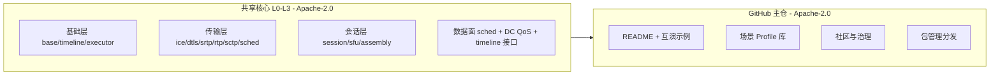

# NimRTC 架构文档

| | |
|---|---|
| 版本 | v0.12 |
| 日期 | 2026-09-14 |
| 状态 | **experimental** — 本文档描述目标架构与路线，**不是已实现能力** |
| 适用 | GitHub 公开读者 / 贡献者 / 集成方 / 立项技术评审 |

> **阅读约定**：全文严格区分「现状 / 已支持」与「目标 / Roadmap」。凡未标注 "已实现" 的能力一律视为设计目标，对外发布前须按 §4.2 的对外措辞纪律与 §13 的 DoD 出口准则校验，避免把计划写成品宣被社区打脸。

---

## 0. 双轨模型概要

NimRTC 采用 **Open-core 双轨**：核心引擎以 Apache-2.0 开源；在此之上组织商业支持与认证交付。



- **共享核心**（§2 全部模块 + §11.2 License 矩阵）= Apache-2.0，全量开源；
- **公开仓库**（GitHub 主仓）：共享核心 + README、社区运营、声明式配置、容器镜像、互通 demo（详见 §16）；
- 边界纪律：实验版不写"生产级 / 安全"；见 §4.2 / §11.1。

---

## 1. 定位（主叙事：Native 领域的 WebRTC 替代）

### 1.1 一句话定位

> **NimRTC —— Native 领域的 WebRTC 替代方案：以可嵌入、可裁剪、跨平台的 C++ 引擎，替代 native 客户端 / SDK / 嵌入式 / 服务端场景中由 libwebrtc 承载的 WebRTC 技术栈，与浏览器及 WebRTC 生态保持 wire 层互通；架构原生支持低时延数据 / 控制通道（P2 起 DC 互通，P1 接口先行）与「画面-控制」统一时间线（P2 接口 + P3 完整），适配 AI Agent 实时交互（P2 起）、机器人 / 车辆遥操作（P2 起）；BWE / 抖动缓冲 / 音频处理 / 密码栈全可插拔，为信创国密预留。**

### 1.2 先在领域上切一刀：替代对象只存在于 Native / 服务端

"替代 WebRTC" 之所以在 Native 领域没有歧义，是因为**浏览器与 Native 两个领域里 "WebRTC" 的所指完全不同**：

| 领域 | "WebRTC" 是什么 | NimRTC 的动作 |
|---|---|---|
| 浏览器 / 网页 | W3C 标准 API（getUserMedia / RTCPeerConnection）+ 内核内置实现，浏览器厂商各自维护、不可插拔 | **不替代**：网页端继续用浏览器原生 WebRTC，NimRTC 只与它互通 |
| **Native / 服务端（主战场）** | 没有"标准 WebRTC 实现"可选——想集成 RTC 能力，实际只有 **libwebrtc 及其派生**（WebRTC.framework、webrtc-android、声网 / 腾讯 TRTC / Zoom 等 fork 与衍生 SDK、各类 C++ SFU 的协议栈来源） | **✅ 替代**：此领域 "WebRTC" 与 "libwebrtc" 是同一件事——替代 WebRTC = 移除 libwebrtc 依赖 |
| 线上协议（跨领域） | SDP / ICE / DTLS / SRTP / RTP / RTCP，IETF 开放标准 | **兼容互通**：wire 互通是客户能迁移采用的前提，不是可选项 |

**一句话结论**：Native 领域不存在"标准 vs 实现"的分家——WebRTC 这个能力只有一个实体，即 libwebrtc 及其派生的垄断。所以：

> 在 Native 领域，**"替代 WebRTC"与"消除 libwebrtc 依赖"是同一句话的两种说法**。对外叙事直接讲"Native 领域的 WebRTC 替代"成立且准确；libwebrtc 不是另一个靶子，只是这场替代中**在代码上被拆掉的那个实体**。

**统一口径（三句话，README 第一屏用）**：
> **叙事上：替代 Native 领域的 WebRTC 技术栈**（客户端 / 嵌入式 / 服务端场景）；**代码上：消除 libwebrtc 依赖**；**协议上：与 WebRTC 生态 wire 互通**——替代的前提是接得进现有生态。

**互通边界（唯一一条，主叙事不再纠缠浏览器）**：
- 浏览器内置 WebRTC 不是替代对象、也不可替代；NimRTC 与 Chrome / Firefox 只做 **wire 层互通**（互通测试矩阵见 §4）。"替代" ≠ "不兼容"——接不进既有生态，就没有人迁移过来。

### 1.3 目标场景矩阵

| 场景 | 产品形态 | 典型客户 / 用途 | 覆盖节奏（P0–P4） |
|---|---|---|---|
| 客户端 SDK | 桌面 / 移动端 SDK，嵌入宿主 App | 音视频应用、协同办公 | ✅ P1 起（传输先行） |
| 嵌入式 / 网关 | 仅传输层的裁剪构建 | 对讲、IPC、边缘网关 | ✅ 架构支持，P1 出体积基线 |
| 服务端 in-process SFU | 库形态的转发引擎，嵌入业务进程 | 房间型会议、直播转推、录制网关 | ✅ P2 |
| AI Agent 实时交互（语音 / 多模态） | 服务端形态：媒体网关 / transceiver，或 SFU 中 Agent 作为参与者（Profile 见 §2.6 `agent-gateway` / `sfu-agent`）；SDK 形态 Agent 终端（Profile `agent`） | 实时语音 Agent、智能客服、Agent 应用 | ✅ P2（DataChannel 互通 + 媒体网关）/ P3（时间线 + 模型输入原语完整） |
| 机器人 / 无人设备遥操作 | 设备端 SDK + 远控端 SDK（共用共享核心，Profile `teleop`） | 巡检、物流、危险作业、远程维修 | ✅ P2 起（DC + 调度）/ P4 完整 |
| 自动驾驶远程接管 / 云控 | 车端 SDK + 云控平台 | Robotaxi / 集卡 / 矿山港口（外部标准见 §8.1） | ✅ 架构支持，P4 交付 |
| 云游戏 / 云渲染串流 | 渲染端 SDK（服务端形态）+ 玩家端 SDK（客户端形态） | 云游戏平台、3D 应用串流、XR 远端渲染 | ✅ P3（随 teleop 族进官方 Profile 组合，见 §2.6） |
| 信创 / 国密 | 双栈加密（国际 + 国密后端） | 政企、关基行业 | ✅ 架构接缝 P1 就位，P4 启用 |

> **场景 = 配置，不是新 SDK**：以上每一行场景都可以从**同一套共享核心**按需选择不同模块实现（BWE / JitterBuffer / 3A / 调度策略 / 时间线 / DataChannel 语义 / 密码后端……），预置为「场景 Profile」并随时覆盖。与 libwebrtc 生态"每场景一个 fork / SDK 分支"不同，NimRTC 一套代码多场景，机制见 **§2.6**。

### 1.4 Non-goals（首期明确不做，详见 §5）

- 不做浏览器内核组件替代
- 不做设备采集 / 播放（首期，媒体源走内存帧接口）
- 不捆绑任何第三方编解码器（尤其 H.264 / H.265 专利问题）
- 不自研 DTLS / SRTP 等安全关键件的密码实现
- 不做完整遥操作 / 接管的业务治理系统（接管权限、双链路调度、审计流程属上层应用；引擎只提供通道、时间线与事件原语，见 §8.5）
- 不宣称"生产可用 / 安全"（P4 前一律 experimental）
- 不做国密第一版实现（只留接缝）

---

## 2. 架构总览

### 2.1 分层示意（一个共享核心，两种应用形态）

NimRTC 既可用来构建 **RTC 服务端应用**（in-process SFU、转发网关等），也可用来构建 **RTC 客户端 App**（音视频通话、收看端等）。两者不是两套代码，而是从**同一个分层核心**按"形态"组装而来——形态层只消费核心能力，不反向依赖：

```
┌────────────────────────────────────────────────────────────────┐
│ 应用形态层（可选组装 · 依赖共享核心 · 不反向依赖）                     │
│                                                                  │
│  客户端 App 形态                    服务端应用形态                  │
│  · 设备采集 / 播放（后期插件化）       · in-process SFU 引擎         │
│  · 播放同步 / 渲染挂钩               · 转发网关 · 录制/转推挂钩      │
│  · 完整走 L2 质量链路(JB/BWE/3A)     · 纯转发路径可整体跳过 L2       │
│                                                                  │
│  AI Agent / 机器人遥操作 / 云游戏 → **客户端 / 服务端 双形态都受益** │
│  · 依赖 L1 DataChannel QoS 语义（部分可靠 TTL / 严格优先级调度）   │
│  · 依赖 L0 timeline 原语（命令与画面对齐，"所见即所控"）           │
│  · 详见 §8.1 / §8.3 / §8.4                                          │
└────────────────────────────────────────────────────────────────┘
          ▲ 客户端与服务端共用同一个分层核心（L0–L3），按形态组装
┌────────────────────────────────────────────────────────────────┐
│ L3  会话层     轻量会话编排 · SDP(独立模块) · Track/Stream         │
│                · BUNDLE / rtcp-mux · RTCP 扩展反馈 · DataChannel 入口│
├────────────────────────────────────────────────────────────────┤
│ L2  媒体质量层 JitterBuffer(固定窗口默认,P3 自适应) · BWE(默认)    │
│                · 3A(基础降噪/Passthrough) · Codec 注入/统一封装    │
├────────────────────────────────────────────────────────────────┤
│ L1  传输层     ICE · DTLS · SRTP/SRTCP · RTP/RTCP                 │
│                · **SCTP/DataChannel（含 QoS 语义：部分可靠TTL /   │
│                  严格优先级调度 / ref_frame 关联）**               │
│                · 发送调度(媒体×数据统一优先级)                     │
├────────────────────────────────────────────────────────────────┤
│ L0  基础层     媒体 Buffer · 时钟/时间线抽象(AI/遥操依赖)          │
│                · Executor · 统计事件端口                          │
└────────────────────────────────────────────────────────────────┘
        ▲ 依赖方向：仅上层依赖下层，下层绝不向上依赖
```

**两种形态的最小组合（裁剪 = 改 CMake 依赖列表，不是改架构）**：
- **客户端 App 形态**：`L0 + L1 + L2 + L3` + 设备采集 / 渲染挂钩（后期插件化）——完整音视频体验链路
- **服务端应用形态**：`L0 + L1 + L3` + SFU / 网关挂钩——**纯转发时跳过 L2**（无需 JitterBuffer / 解码 / 3A）
- **数据面是共享核心能力**：时间线原语在 L0、发送调度在 L1、DataChannel API 在 L3——遥操作端（客户端形态）与 Agent 网关 / SFU（服务端形态）都能直接用（见 §8）
- **纯传输 / 网关形态**：`L0 + L1 + L3` 的协商最小子集（SDP 收发 + ICE/DTLS，不含媒体编排）；若协商在宿主侧完成（私有信令注入 ICE 凭据 / DTLS 指纹），媒体面可退化为 `L0 + L1`——**面向 WebRTC 生态的互通型网关至少需要 L3**

### 2.2 分层与模块规则

1. **严格分层**：下层不向上依赖；模块间只通过抽象接口交互；禁止跨模块直接访问内部实现。
2. **独立编译、独立单测**：每个模块是独立 CMake 静态库 target，可脱离完整 RTC 会话单独验证。
3. **按需裁剪是架构属性**：服务端纯转发形态 `L0 + L1 + L3`（跳过 L2）即可构成 SFU；传输 / 网关形态取 `L0 + L1 + L3` 的协商最小子集，纯 `L0 + L1` 仅在宿主完成协商时作媒体面组件（见 §2.1 注）。裁剪不是改代码，是改 CMake 依赖列表。
4. **无全局变量**：完整支持多实例并发——这是 SFU 多路会话的硬前提，也是 vs 单体引擎最硬的工程证据。

### 2.3 模块清单与 CMake 目标

| 模块 | target | 职责 | 首期 |
|---|---|---|---|
| base | nimrtc_base | 媒体 Buffer、时钟抽象、Executor、统计端口 | ✅ |
| ice | nimrtc_ice | ICE/ICE-lite、BUNDLE、consent freshness | ✅ P1 |
| dtls | nimrtc_dtls | DTLS 封装，**后端可插拔**（BoringSSL / mbedTLS / 国密） | ✅ P1 |
| srtp | nimrtc_srtp | SRTP/SRTCP 封装，**后端可插拔**（libsrtp / 国密 SM4） | ✅ P1 |
| rtp | nimrtc_rtp | RTP/RTCP 编解码、媒体 payload 打包/解析、标准反馈（transport-cc / NACK / REMB） | ✅ P1 |
| sched | nimrtc_sched | L1 发送调度：RTP × DataChannel 统一严格优先级 + pacing | ⏸ 接口 P1 / 实现 P2 |
| sctp | nimrtc_sctp | DataChannel（usrsctp）：可靠 / 不可靠 / 有序 / 无序 + 部分可靠 | ✅ P2 |
| timeline | nimrtc_timeline | 统一时间线：RTCP-SR NTP↔RTP ts 映射、帧 capture ts、渲染 age | ⏸ 接口 P2 / 完整 P3 |
| codec | nimrtc_codec | 编解码**注入接口**（encoder/decoder 由宿主或插件提供）+ 统一封装；不捆绑解码器（payload 打包归 rtp 模块） | ✅ 接口 P1 最小 / 完整 P3 |
| jitter | nimrtc_jitter | 音/视频 JitterBuffer 抽象 + 固定窗口默认实现（自适应版 P3） | ✅ P1 最小可用 |
| bwe | nimrtc_bwe | 拥塞控制抽象 + 接口 + 固定/AIMD 默认实现（Goog-CC 完整 P3） | ✅ P1 |
| audio3a | nimrtc_audio3a | 3A 抽象（内置 passthrough + 基础降噪 / 可关 / 第三方） | ✅ P1 |
| session | nimrtc_session | 会话编排、SDP 生成/解析、Track/Stream | ✅ P1 |
| assembly | nimrtc_assembly | **场景装配**：Profile 注册表 + Engine::Builder，把各接缝实现按场景绑定；运行期受限重配 | ✅ P1 骨架 / P2 Profile 库 |
| sfu | nimrtc_sfu | **服务端形态**：in-process 转发引擎（裸 RTP 收转发） | ⏸ P2 |
| device | nimrtc_device | **客户端形态**：采集 / 播放抽象（ALSA/CoreAudio/AAudio/WASAPI） | ⏸ 插件化，后期 |

### 2.4 目录骨架（草案）

```
nimrtc/
├─ CMakeLists.txt                 # 顶层：option 开关控制裁剪
├─ modules/
│  ├─ base/  timeline/  ice/  dtls/  srtp/  rtp/  sched/
│  ├─ sctp/  codec/  jitter/  bwe/  audio3a/
│  ├─ session/  sfu/  device/  assembly/
│  └─ <每模块>/tests/             # 同级单测，可独立跑
├─ profiles/                      # 场景 Profile 声明示例（见 §2.6）
├─ apps/
│  ├─ echo-loopback/              # 本机回环自测（无设备、无网络）
│  ├─ demo-p2p/                   # 内存帧源 + demo 信令，与 Chrome 互通
│  ├─ sfu-relay/                  # 转发压测工具
│  └─ (后期) demo-teleop/         # 遥操作 / Agent 接入示例
├─ interop/                       # 浏览器互通测试套件（一等公民，见 §4.2）
├─ third_party/                   # mbedTLS/BoringSSL · libsrtp · usrsctp(P2)
├─ LICENSE / NOTICE / CONTRIBUTING.md
```

### 2.5 可插拔接缝清单（严格限定）

**原则**：抽象只在"确有多种实现需求"的接缝上做。BWE / Jitter / 3A 之间高度耦合，是全 RTC 质量最集中的地方——**可插拔不等于默认实现可以平庸**，每条接缝必须有且只有一条高质量主线默认实现。

| 接缝 | 抽象点 | 已知实现方向 | 默认 |
|---|---|---|---|
| Crypto 后端 | DTLS/SSL 库、SRTP 加解密 | 国际（BoringSSL/mbedTLS + libsrtp）／国密（SM2/SM4，P4） | 国际套件 |
| BWE | 发送码率决策器 | Goog-CC 兼容主线／自定义 | Goog-CC 兼容 |
| JitterBuffer | 音/视频抖动缓冲策略 | 低延迟通话 / 直播 / 对讲 | 通话主线 |
| 3A | AEC/ANS/AGC | 内置实现 / 第三方 / 关闭 | 可关闭 |
| Codec | 解码器接入 + payload 封装 | H.264/H.265/VP8/VP9/AV1/Opus（外部解码器） | 仅封装，不捆绑 |
| Device（后期） | 采集 / 播放 | 四平台后端 | 插件化 |
| DataChannel 语义 | 每消息流：可靠性 / 有序性 / 部分可靠 TTL / 优先级 | 浏览器互通子集（可靠·不可靠）／引擎扩展（部分可靠 + 严格优先级，§8.3） | 引擎扩展主线 |
| 发送调度策略 | RTP × 数据统一发送队列 | 严格优先级默认（控制指令 > 音频 > 视频关键帧 > 普通视频 > 尽力而为数据）／自定义 | 严格优先级 |

### 2.6 场景装配与实现切换（Scene Assembly）

> §2.5 回答了"每条接缝有哪些实现可选"；本节回答 **"什么场景选哪套组合、什么时候可以切换"**。这是"可插拔"从架构理念变成**产品能力**的一步：**一套代码、多个场景 Profile——场景 = 配置选择，不是新 SDK、更不是新 fork。**

**（a）装配层次与切换时机——先分清四个时机，才敢承诺"可切换"**

| 层次 | 时机 | 机制 | 可换范围 | 典型例子 |
|---|---|---|---|---|
| 构建期 | 编译时 | CMake 裁剪（§2.2 规则 3） | 形态级：客户端 / 服务端 / 纯传输 | 嵌入式传输网关 = `L0+L1`，不含任何媒体模块 |
| 装配期 | `Engine::Create` 时 | `Builder` + Profile 绑定各接缝实现 | 引擎级默认组合 | 一个进程默认 `sfu` Profile；另一进程按 `teleop` Profile 起网关 |
| 会话边界 | 每会话 / 每轨道创建 | 会话携带自身 Profile，或继承引擎默认 | **同一进程内不同会话跑不同实现** | 同一引擎内 会话 A = 通话，会话 B = 遥操作，互不干扰（依赖 D3 无全局状态） |
| 运行期 | 会话进行中 | **受限**：显式 `Reconfigure` / 流重建 | 仅两类接缝（见下） | 弱网场景切换调度策略；握手前换 crypto 后端 |

**运行期"热切换"的诚实边界**：有内部状态的模块（JitterBuffer / BWE / 3A）**不允许静默热换**——要么走显式 `Pause → Drain → Rebind → Resume` 协议，要么按"轨道重建 / renegotiation"处理（远端 SDP 变化时本就发生）。无状态或轻状态接缝（日志 / 统计 / crypto 后端（握手前）/ 调度策略）可运行期切换。**一切切换必须是显式 API 调用 + 统计事件输出（§9），不存在"引擎自己偷偷换实现"。**

**（b）场景 Profile 速查表（默认推荐组合，全部可单点覆盖）**

| Profile | 适用 | BWE | JitterBuffer | 3A | 调度 / DC 语义 | timeline | crypto |
|---|---|---|---|---|---|---|---|
| call | 双向音视频通话 | Goog-CC 主线 | 低延迟通话档 | 内置 | 默认；媒体为主 | 关 | 国际 |
| live | 直播 / 收看 | Goog-CC（延迟容忍） | 直播抗抖动档 | 内置 | 默认 | 关 | 国际 |
| ptt | 半双工对讲 / 集群 | Goog-CC 主线 | 对讲档（延迟优先） | 可关 | 音频优先 | 关 | 国际 |
| agent | AI Agent 实时交互（**SDK 形态：Agent 终端**） | Goog-CC 主线 | 低延迟通话档 | 内置（流式） | 控制 > 音频；事件 DC 部分可靠有序；**模型输入 PCM tap 原语（§8.7）** | **帧级开** | 国际 |
| **agent-gateway** | AI Agent 实时交互（**服务端形态：媒体网关 / transceiver**，直连 1:1 Agent） | Goog-CC 主线 | **无 L2（网关侧不解码可选旁路解码 + 模型输入 tap）** | 透传（模型侧处理） | 控制 > 音频；事件 DC 部分可靠有序；**模型输入 PCM tap 原语** | 帧级开 | 国际 |
| **sfu-agent** | AI Agent 实时交互（**SFU 形态：Agent 作为 SFU 参与者**，控制/事件 DC 选择性转发） | 无（转发跳过 L2） | 无 | 无（透传） | 转发公平 + **DC 转发策略（按消息流声明的转发标签转发）** | 帧级开 + **重新校准**（不让时间戳随 hop 漂移） | 国际 |
| teleop | 机器人 / 无人设备遥操作 | Goog-CC 主线 | 低延迟通话档 | 关或第三方 | **严格优先级（指令插队）+ DC 不可靠无序 + TTL 丢旧保新** | **帧级 + 样本级** | 国际 / 国密可选 |
| takeover | 自动驾驶远程接管 / 云控 | 同 teleop（多路视频） | 低延迟通话档 | 关或第三方 | 同 teleop + 高频心跳 / dead-man | 帧级 + 样本级 | **国密（SM）+ 双链路** |
| cloudgame | 云游戏 / 云渲染串流（teleop 族） | **高码率主线**（视频即体验本体，降级坡度缓） | 低延迟档（下行为主） | 关（无采集端） | 同 teleop（输入严格优先级 / 丢旧保新）+ **上行高频状态流原语** | **帧级（输入↔渲染帧）** | 国际 |
| sfu | 服务端转发 | 无（转发跳过 L2） | 无 | 无 | 转发公平 | 关 | 国际 |
| transport | 嵌入式 / 传输网关 | 无（`L0+L1`） | 无 | 无 | 极简 | 关 | 国际 / 国密可选 |

- Profile 是**默认推荐 + 可覆盖**：上层可继承官方 Profile 再单点覆盖某条接缝（"teleop 但 3A 用第三方"），不设硬编码模式。**Profile JSON schema 见 [ADR-010](docs/adr/ADR-010-profile-json-format.md)**；接缝后端由 PAL resolver 注入（Slice 1 见 [ADR-009](docs/adr/ADR-009-pal-slice-1.md)）。
- 落点：机制在 `assembly` 模块（Profile 注册表 + Builder）；`profiles/` 目录放声明式示例（JSON / TOML），C++ Builder 为第一形态。
- **防呆（呼应 D2）**：每个 Profile 的官方组合**只有一条高质量主线**；可覆盖项是"专家模式"，README 不宣传为默认。
- **cloudgame 与 teleop 的差异**（同属「画面下行 + 控制输入上行」族，仅 4 处覆盖，官方组合不另起炉灶）：
  ① **视频权重反转**——teleop 中视频是「观察」，拥塞时可大幅压码率保控制；云游戏中视频是**体验本体**，BWE 走高码率主线（HEVC/AV1/4K）、降级坡度缓。好在输入包体积小到可忽略，两者不构成带宽竞争，不会逼引擎做二选一；
  ② **timeline 语义偏移**——由「对所见帧做决策」变为「输入对齐其触发的**渲染帧**」（防输入-画面错位抖动）；
  ③ **上行是高频事件 / 状态流**（键鼠采样率远高于遥操作指令频率），引擎提供输入通道原语，采样 / 合并策略交上层自定；
  ④ **伴音单向**——游戏音效需与画面紧同步但无采集端，3A 依旧关闭。

**（c）为何这是差异化（README 可用）**
> libwebrtc 生态解决"多场景"的办法是 fork / 多 SDK 分支，各场景实现互相漂移；一体式轻量库只能调参、换不了实现。NimRTC 把"场景"做成 **Profile 层**：同一条接缝的不同实现（Goog-CC / 自自定义、通话 / 直播 / 对讲 JB、内置 / 第三方 / 关闭 3A、国际 / 国密 crypto）按场景组合——构建期裁剪、装配期绑定、会话级并存、运行期受限切换，**一套代码覆盖 通话 / 直播 / 对讲 / AI Agent / 遥操作 / 接管 / 云游戏 / SFU / 嵌入式**。

---

## 3. 关键设计决策（ADR-lite）

| # | 决策 | 理由 | 代价 / 对冲 |
|---|---|---|---|
| D1 | **安全关键件不自研**：DTLS 走 mbedTLS/BoringSSL 后端，SRTP 复用/借鉴 libsrtp | 少一个需要安全审计的面（涉媒体加密的实现一旦宣称即招安全审计压力） | 用后端抽象保留替换权（国密也从此接入） |
| D2 | 媒体质量模块默认只留一条高质量主线 | BWE/Jitter/3A 联动决定 QoE，多套默认=无人维护 | 接口层允许插拔，实现层聚焦单主线 |
| D3 | 无全局变量、多实例并发为硬约束 | SFU 多路会话刚需；也是 vs 单体引擎的差异化证据 | 单例/缓存一律走实例注入 |
| D4 | 线程模型 = 可注入 Executor；默认网络与媒体独立线程；支持单线程事件驱动 | 嵌入式 CPU 受限场景需要单线程驱动 | **不承诺**"纯单线程跑满全功能"；文档如实表述 |
| D5 | 引用计数媒体 Buffer，转发路径零整帧拷贝 | 高码率、多路转发性能关键 | 生命期规则写进贡献者文档 |
| D6 | 时钟全抽象：媒体时钟 / RTP 时间戳 / 系统时钟解耦 | 单测可模拟时间；嵌入式时钟漂移可控 | — |
| D7 | SDP 独立模块，不绑定会话状态机 | 可单独复用（信令网关、录制分析） | — |
| D8 | **数据面发送严格优先级调度**：控制指令 > 音频 > 视频关键帧 > 普通视频 > 尽力而为数据；拥塞时由 BWE 压视频让带宽，绝不让媒体排挤控制 | 遥操作 / Agent 场景"到达率优先于清晰度"（§8.1）；浏览器 DataChannel priority 只是 hint——引擎侧可控是差异化 | 调度器在 L1，与 BWE/JB 联合调参，遵守 D2 单主线 |
| D9 | **媒体-数据统一时间线**：RTCP-SR NTP↔RTP ts 映射 + 帧 capture 时间戳 + 渲染 age 查询 | "画面-控制同步"无法靠两端独立时钟达成；AI 对"所见帧"决策、遥操作闭环都是刚需 | 接口在架构中默认就位、按场景开启（关闭路径仍可编译通过 = 零开销）；`agent` / `agent-gateway` / `sfu-agent` / `teleop` / `takeover` / `cloudgame` Profile 默认开启（Profile 表已声明） |
| D10 | **场景装配与切换纪律**：实现选择只发生在 构建期 / 装配期 / 会话边界 三处 + 运行期显式 `Reconfigure`；有内部状态的模块（JB / BWE / 3A）禁止静默热换（走 Pause→Drain→Rebind→Resume 或流重建）；Profile 官方组合每场景仅一条高质量主线 | "多场景 = 多实现"若无纪律会退化成组合爆炸，运行期乱换实现会静默丢状态 | 集中在 assembly 模块 + 显式 API；切换事件全部进统计（§9） |
| D11 | **PAL Slice 1 — engine plugin resolver seam**：`engine.cpp` 通过 `pal::resolve_*` 内联 forwarder 走 `core::PluginRegistry`，公开 API 字节一致；Slice 2/3 进 v0.10.x 补丁轨道 | 详 [ADR-009](docs/adr/ADR-009-pal-slice-1.md) + [PAL 架构](docs/plan/pal-architecture.md) §4 | Slice 1 是 ~50 LOC 薄 alias，后续 API 演化成本随 transitive 依赖放大 → header-only + 字节级向后兼容 |
| D12 | **JSON 作为声明式 Profile 一等公民**：与 C++ Builder 同等 first-class；现有 `profiles/*.json` 固定 schema v1.0；schema 变更遵循 SemVer（任何 break → 升 MINOR） | 详 [ADR-010](docs/adr/ADR-010-profile-json-format.md) + §2.6 Profile 表 | 双格式长期维护成本（CI 校验 json↔builder 一致） |
| D13 | **遥操作指标 caliber = single-hop 预算**：引擎只承担端到端单跳；多跳端到端验收标准（DB31/T 1505—2024 / T/SSITS 2003—2023）是积分商责任 | 详 [ADR-011](docs/adr/ADR-011-teleop-metrics-caliber.md) + §8.5 引擎边界表 | 上层若需端到端指标须自行组合多段预算 |
| D14 | **中文文档归口 `docs/zh/`**：本文即 `docs/zh/architecture.md` 主版本；旧 `NimRTC-V2-技术文档.md` 改 32 行重定向 stub 保留外链兼容；独立中文站点 docs-zh.nimrtc.dev 推迟到 v1.0+ | 详 [ADR-012](docs/adr/ADR-012-zh-docs-layout.md) + §16.5 | 旧 stub 需长期保留至外链收敛 |

---

## 4. 协议兼容策略（v1"完整兼容" → 分级路线图）

### 4.1 为什么必须分级

Chrome 的兼容面不是 RFC 文档，而是 **Chrome 的实际行为**。ICE tricks、mDNS 候选、consent freshness、BUNDLE、transport-cc、RTX、RED/FEC、simulcast、DTLS 演进……每一项都是独立深坑，且每年都在变。"从零完整兼容"= 数年人年，是一个无底洞承诺。

### 4.2 兼容分级

| 层级 | 承诺 | 典型条目 | 状态 |
|---|---|---|---|
| **Tier 0 互通基线** | Chrome ↔ NimRTC P2P 音/视频双向互通（稳定浏览器） | ICE（含 BUNDLE / rtcp-mux / consent freshness）、DTLS 1.2、SRTP 强制套件、RTP/RTCP、基础 NACK + transport-cc、Opus + H.264 payload（打包在 rtp 模块；编 / 解码器经宿主注入接口提供，见 §5） | **P1 出口，唯一正式承诺** |
| **Tier 1 主流兼容** | 与主流浏览器主流特性互通 | simulcast / SVC、RED/FEC、VP8/VP9/AV1 payload、DataChannel(SCTP)、mDNS 候选 | **DataChannel 为 P2 首项**（基础互通，见 §8/§13），其余逐项 TBD |
| **Tier 2 全量对齐** | 企业级长尾 | Chrome 行为差异对照表、边界设备、弱网算法标定 | 长期路线图，**不承诺时间** |

**对外措辞纪律**：README/宣传中禁止出现"完整兼容 WebRTC"；只写 "Tier 0: 与 Chrome/Firefox P2P 互通（当前范围）"，其余列 Roadmap。

### 4.3 互通测试 = 一等公民

- `interop/` 目录常驻 CI：**Chrome / Firefox（固定版本矩阵）↔ NimRTC 双向互通**自动化用例。
- 每次合入跑互通矩阵；互通失败 = 阻塞合并（红线）。
- 与 Chrome 的实际互通测试，比任何 RFC 自查都更能定义"兼容"。

---

## 5. 范围清单：做 / 后置 / 不做

| 能力 | 处置 | 阶段 | 说明 |
|---|---|---|---|
| ICE / DTLS / SRTP / RTP/RTCP 传输 | ✅ 做 | P1 | 首期核心 |
| SDP 生成/解析（独立模块） | ✅ 做 | P1 | 不与会话状态机耦合 |
| 会话编排（Track/Stream、BUNDLE、rtcp-mux） | ✅ 做 | P1 | 单端口多流原生支持 |
| 内存帧媒体源（demo/互通用） | ✅ 做 | P1 | 无设备层也能跑通全链路 |
| SFU 转发引擎（裸 RTP 收转发） | ✅ 做 | P2 | 不需 Jitter/解码，纯转发路径 |
| 设备采集 / 播放 | ⏸ 后置 | 插件化 | 首期不做，砍掉最大一块范围 |
| SCTP / DataChannel（基础互通） | ✅ 做 | P2 | 可靠 / 不可靠 / 有序 / 无序；与 Chrome 互通（Tier 1 首项，见 §8） |
| 低时延控制语义（部分可靠 TTL、严格优先级调度） | ✅ 做 | P1 接口 + P2 调度实现 + P3 部分可靠 | DataChannel API + QoS 语义 P1 就位；调度实现 P2；TTL/PR-SCTP P3，见 §8.2/§8.3 |
| 场景装配（Profile / assembly） | ✅ 做 | P1 骨架 / P2 完整 | 各接缝实现按场景绑定 + 声明式 Profile 示例，见 §2.6 |
| 媒体-数据统一时间线 / 画面-控制对齐 | ✅ 做 | P2 接口 + P3 完整 | timeline 模块默认关闭（零开销），接口与基本能力 P2、命令-画面关联 API P3，见 §8.4 |
| 双链路冗余 / 接管会话迁移 | ✅ 做 | P4 | 引擎提供原语，完整方案 P4 交付，见 §8.5 |
| simulcast / SVC | ⏸ 后置 | Tier 1 | 接口预留 |
| JitterBuffer / BWE / 3A | ✅ 做 | P1 最小 + P3 自适应/完整 | 固定窗口 JB + 简单 AIMD BWE + passthrough/基础降噪 P1 即通话体验可用；P3 替换为自适应 JB + Goog-CC 完整主线 + 完整 3A（弱网基线在 P3 验收） |
| Codec 注入接口 / 统一封装（解码器由宿主提供） | ✅ 接口 P1 最小（互通需要）→ P3 完整 | — | 不捆绑解码器；payload 打包/解析归 rtp 模块（P1 含 Opus/H.264 支撑 Tier 0） |
| 国密后端（SM2/SM4 密码栈） | ✅ 做 | P4（架构接缝 P1 就位） | 架构接缝 P1 就位；落地交付 P4，见 §10 |
| 双链路调度完整策略 | ✅ 做 | P4 | §8.5 框架 + 完整调度 P4 |
| 信创适配矩阵（鲲鹏/飞腾/麒麟/UOS） | ✅ 做 | P4 起持续维护 | — |
| 自研 DTLS/SRTP 密码实现 | ❌ 不做 | 永远 | 外包给经过审计的后端 |
| 捆绑 H.264/H.265 解码器 | ❌ 不做 | 永远 | 专利风险，见 §11.3 |
| 开源范围内的房间/信令服务 | ❌ 不做 | — | 仅提供 demo 级信令；上层业务自接 |
| 浏览器内核替代 | ❌ 不做 | 永远 | 主战场限定 Native；浏览器只互通、不替代（见 §1.2） |

---

## 6. 媒体质量链路（P1 最小可用 + P3 自适应/完整）

> P1 交付**最小可用版质量链路**（固定窗口 JitterBuffer + 简单 AIMD BWE + passthrough/基础降噪 3A），保证 Chrome ↔ NimRTC P2P 通话"体验可用"。**完整质量线（自适应 JB + Goog-CC 兼容主线 + 完整 3A + 弱网基线）放到 P3**。传输层与 SFU 转发均不依赖本节内容（P1 / P2 即可独立交付）。质量是 Google 烧了十几年钱的地方，本节是客户端体验层、也是区分度最大的环节。

- **JitterBuffer**：音/视频策略抽象（低延迟通话 / 直播 / 对讲三档默认策略），P1 先交付**固定窗口实现**，P3 替换为**自适应 JB**；三档与各场景 Profile 的对应关系见 §2.6。
- **BWE**：P1 交付**简单 AIMD 默认实现**，接口完整、可插拔；P3 替换为 **Goog-CC 兼容主线**作为对外承诺主线；**BBR 不写入对外文档**（RTC over UDP 用 BBR 仍属实验，写出去会被懂行的人抓），仅作内部实验项。
- **3A**：接口支持 内置实现 / 第三方 AEC·ANS·AGC / 直接关闭（信创设备常自带算法）；P1 交付 passthrough + 基础降噪（开箱即用），P3 补完整 3A。
- **Codec**：解码器接入抽象 + 统一封装；编 / 解码器一律由宿主或插件提供、core 不捆绑。payload 打包 / 解析归 rtp 模块（P1 即含 Opus / H.264，支撑 Tier 0 互通；见 §5）。PAL Slice 1 引入 `pal::resolve_codec()` / `pal::resolve_video_codec()` 走 `core::PluginRegistry`（详 [ADR-009](docs/adr/ADR-009-pal-slice-1.md)）。

> **P1 体验可用 ≠ P3 生产质量**：P1 交付是"能打电话"，P3 交付是"在 30% 丢包 / 弱网下画面不崩、控制不丢"。社区不要把 P1 当生产指标看待，文档与 README 一律标注 experimental（呼应 §11.1）。

---

## 7. 服务端与 SFU（P2）

- **差异化生态位：in-process 嵌入式 SFU 引擎**——库形态，嵌入业务进程，不要求独立部署（vs mediasoup 需独立 worker 进程）。
- 原生支持 **BUNDLE / rtcp-mux / 单端口多流**：一个 ICE 会话承载多路媒体流，SFU 转发场景零 hack。
- 转发路径走 D5 引用计数 Buffer + 零拷贝；提供 `sfu-relay` 压测工具，产出可复现的 pps / Mbps 基准（§14）。
- RTCP 可扩展，允许注册自定义反馈类型（为私有 QoE 反馈、国密扩展留口）。

### 7.1 DC / 控制消息 / 时间线在 SFU 中的转发语义（P2 起，呼应 §2.6 `sfu-agent` Profile）

> **SFU 不只是 RTP 转发器**——AI Agent / 遥操场景里，SFU 形态也跑控制消息，行为必须可声明、可观测。下列语义与 §2.6 Profile 表对齐，引擎不替上层做"是否转发"的策略决策，只提供原语与默认值。

- **媒体转发**：裸 RTP 收转发，`L0 + L1 + L3` 即可（不依赖 L2）；与 §2.6 `sfu` Profile 一致。
- **DataChannel 转发策略**：
  - DC 消息按消息流声明的 **转发标签**（forward-tag = `all` / `none` / `selector`）决定是否跨参与者转发，默认 `all`（普通聊天）。
  - SFU **不做内容审计**（审计是上层应用的事；引擎只按"标签 + QoS 声明"转发，呼应 §1.4 non-goal）。
  - 选择性转发场景（如 AI Agent 作为 SFU 参与者时只让工具调用事件到指定 peer）通过 `selector` 标签 + 上层策略文件实现。
- **时间线在 SFU 中的处理**：
  - **不重新校准**：`sfu` Profile 默认转发透传时间戳，避免多 hop 漂移。
  - **`sfu-agent` Profile 按需校准**：Agent 网关需给下游模型稳定时间基准时，由 SFU 在出口侧打"参考 NTP↔RTP ts 重新映射"（避免累积漂移）。
- **RTCP 转发**：
  - SR/RR 默认透传；**自定义 RTCP 反馈**（私有 QoE / 国密扩展）按 Profile 决定 SFU 是否合并 / 重写。
- **AI Agent 作为参与者的特殊行为**（呼应 §2.6 `sfu-agent`）：
  - **模型输入 PCM tap 旁路**（§8.7）：SFU 形态的 Agent 也可通过 RTP 解码旁路 tap，**无需上层在每个 peer 端都接解码**。
  - **心跳 / dead-man 由 Profile 控制**：takeover Profile 强制心跳，不在 SFU 层强制；其它 Profile 默认不上心跳逻辑。

> **诚实边界**：SFU 形态的 AI Agent 接入是 P2 起的"可组装能力"，**不承诺**任何"开箱即用的 Agent 网关产品"——上层应用需基于本节原语组合自己的 Agent 网关逻辑（与 §1.4 不做遥操业务治理系统 一致）。

---

## 8. 低时延数据面与控制通道（DataChannel · 时间同步 · 遥操作 / AI Agent）

> 前一版把 DataChannel 只当作"协议完整性"补项（§4.2 Tier 1）；**AI Agent 实时交互与机器人 / 车辆遥操作把它升级为一等需求**：除音视频外，还需要一条能**插队、区分可靠/实时语义、并与画面逐帧对齐**的数据通道。本章把「低时延控制通道 + 画面同步」从特性升级为架构决策（D8 / D9）。

### 8.1 目标场景与硬需求

| 场景 | 数据流的形态 | 硬需求 |
|---|---|---|
| AI Agent 实时交互（语音 / 多模态） | 媒体走 RTP；事件 / 工具调用 / 打断语义走 DataChannel（业界形态：OpenAI Realtime 等以命名数据通道传 JSON 事件，如 `oai-events`；SFU 场景 Agent 作为普通参与者加入，1:1 场景可 transceiver 直连网关） | DataChannel 互通是接入前提；打断时渲染队列可冲刷；音频流式入模型（不等整段） |
| 机器人 / 无人设备遥操作 | 下行控制指令（速度 / 关节 / 急停），上行遥测（IMU / 里程 / 状态） | 指令高到达率、不被画面挤占；命令与画面时间对齐（"所见即所控"） |
| 自动驾驶远程接管 / 云控 | 方向 / 油门 / 制动 / 紧急停车 + 多路视频回传 | 监管级时延与双链路冗余；控制通道强加密（呼应国密 §10） |

**外部参考值**（引用行业 / 地方标准，**非 NimRTC 引擎承诺**——引擎只负责把"自己那一跳"的预算做小且可测）：

| 来源 | 关键数值（端到端 / 系统级） |
|---|---|
| DB31/T 1505—2024（自动驾驶集卡，上海市地方标准） | 远程驾驶时控制指令频率 **≥ 20 Hz**、交互时延 **< 30 ms**、视频传输时延宜 **< 250 ms**；通信链路宜设 **≥ 2 条独立且互不干扰** |
| T/SSITS 2003—2023（低速无人设备远程驾驶系统规范） | 分车速档：控制端到端时延 **≤ 100 / 70 / 30 ms**，视频时延 **≤ 300 / 200 / 180 ms**，对应 RTT ≤ 100 / 70 / 30 ms、jitter95 ≤ 100 / 50 / 20 ms、丢包率 ≤ 30% / 20% / 10%；信道加密要求覆盖**控制指令、状态、音视频** |
| 业界工程口径（云控 / 远控方案公开资料） | "控制通道的延迟与到达率优先于画面清晰度"；30% 丢包下画面卡顿可控；基站切换毫秒级预切 |

**衍生结论**：① 数据通道必须有独立 QoS 语义（§8.2）；② 媒体拥塞时**画面主动让路**而不是挤占控制（§8.3）；③ 需要统一时间线才能回答"这条指令对应哪一帧画面"（§8.4）；④ 接管 / 冗余是体系能力，引擎提供原语、完整方案归 P4 交付（§8.5）。

### 8.2 数据面通道模型（每条消息流声明 QoS）

DataChannel 不止"开 / 关"——每条流声明一组语义：

| 语义 | 建议用途 | 实现 |
|---|---|---|
| 可靠 · 有序 | 文件、日志、Agent 长上下文事件 | SCTP reliable ordered |
| **不可靠 · 无序 · 部分可靠（TTL / 重传上限）** | **遥操作控制指令：丢旧保新、只认最新值** | PR-SCTP 部分可靠 |
| 尽力而为（高频遥测 / 占位） | 周期性状态、打点 | 不可靠流 |
| 每流附加元数据 | 调度优先级、时延预算、sync-tag（关联媒体流） | 引擎 DC API 扩展 |

> **差异化（表述要经得起审）**：浏览器 / 标准 DataChannel 也能表达部分可靠（建链参数 `maxPacketLifeTime` / `maxRetransmits`）与 priority（仅 hint），但都是**通道建链时一次性设定的静态语义**，priority 不保证调度。NimRTC 在 native 侧提供的是**每条消息流可动态声明的 QoS（含部分可靠 TTL）+ 与媒体同队列的严格优先级调度 + 消息时间戳 / ref_frame**——把"建完通道就不能改、调度无保证"变成"运行期可控、与画面可对齐"的动态语义，这才是 libwebrtc 生态给不了、遥操作又必须有的能力。

### 8.3 发送调度：控制不排队，画面主动让路

- L1 统一发送调度器（`sched` 模块）：RTP（媒体）与 DataChannel（数据）进入**同一优先级队列**，默认策略：
  **控制指令 > 音频 > 视频关键帧（I 帧）> 普通视频 > 尽力而为数据**；
- 拥塞时**先由 BWE 压视频码率 / 帧率让出带宽**，不允许"视频把控制消息挤掉"或"控制等视频排完队"；
- 关键帧突发（PLI 响应 / 新端全帧）也要分级节流，避免洪泛压死控制面；
- 调度策略可注入（接缝清单 §2.5），默认严格优先级主线开箱即用。

### 8.4 媒体-数据统一时间线（画面-控制同步）

两个独立时钟无法回答"操作员 / Agent 此刻看到的画面是哪一帧、这条指令相对它晚了多久"。方案：

- **时间线**（timeline 模块，落在 D6 时钟抽象之上）：由 RTCP SR 的 NTP↔RTP 时间戳映射（RFC 3550 / RFC 6051）建立会话共享参考时钟；
- **帧级原语**：发送端媒体帧携带 `capture_ts`；接收端可查询**当前渲染帧**的 (capture_ts, frame_seq) 与其"画面龄"（presentation age）；
- **命令-画面关联**：控制消息可携带 `ref_frame`（"我依据哪一帧决策 / 下达"），遥操作端与 AI Agent 都能实现对所见画面发指令（"所见即所控"）；
- **E2E 时延分解**：导出 采集 → 入网 → 出网 → 渲染 各跳时延事件，供上层显示与校准；
- **三种对齐粒度**：会话级（建立共享参考时钟，一次校准全程复用）／帧级（命令挂帧号，AI 场景主用）／样本级（控制-执行精确对准，机械臂 / 线控执行器）；
- **按场景开启 / 关闭**：timeline 接口在架构中默认就位（D9），按 Profile 开启——`call` / `live` / `ptt` / `sfu` / `transport` 默认关；`agent` / `agent-gateway` / `sfu-agent` / `teleop` / `takeover` / `cloudgame` 默认开。关闭路径仍可编译通过、零运行时开销（不解析 SR、不挂帧级事件）。

### 8.5 遥操作可靠性与接管（引擎边界）

> **caliber 边界**：引擎指标口径收敛为 single-hop 预算；多跳端到端验收标准（DB31/T 1505—2024 / T/SSITS 2003—2023）属于积分商责任，不写入引擎 SLA。详见 [ADR-011](docs/adr/ADR-011-teleop-metrics-caliber.md)。

| 能力 | 归属 |
|---|---|
| 心跳 / 看门狗、dead-man switch 原语（定期确认事件） | ✅ 引擎：DC 事件 + 超时回调 |
| 渲染队列冲刷（打断 / barge-in / 紧急降级） | ✅ 引擎：播放缓冲 flush 事件 |
| 会话迁移 / 接管（操作台 A→B、Agent→人工） | ✅ 引擎：ICE restart + 快速 renegotiation 支持；控制端切换由上层编排 |
| 双链路冗余（≥ 2 条独立链路） | ✅ 引擎：多传输实例并发（D3）；切换策略 P4 完整化 |
| 接管权限、全程审计、责任认定 | ❌ 上层业务；引擎提供带时间戳的事件供回溯 |

### 8.6 分期与架构落点

- 落点：时间线原语 → L0 / timeline 模块；发送调度 → L1 / sched 模块；DC API → L3 session。
- 分期：**P1** 发送调度契约（sched 接口）+ DataChannel API 入口（无 SCTP 实现，先定接口与 QoS 语义）；**P2** timeline 接口 + DataChannel 基础互通（usrsctp 接入）+ 调度实现 + assembly Profile 库 + 模型输入 PCM tap 原语（P2 首项 §8.7）；**P3** 部分可靠（TTL）+ timeline 完整实现 + 命令-画面关联 API + cloudgame 官方 Profile 组合；**P4** 双链路 / 接管方案完整化交付。
- 指标（§14 量化目标）：引擎单跳处理预算、控制不被挤占、时间线精度——全部【待实测】，禁止先写数字。

### 8.7 模型输入原语（P2 起，呼应 §2.6 `agent` / `agent-gateway` / `sfu-agent` Profile）

> AI Agent 硬需求是"音频流式入模型（不等整段）"。通用 codec 注入接口（§6）只覆盖"宿主 / 插件接外部解码器"，**没覆盖"模型订阅解码后 PCM 的稳定 hook"**。本节定义这个 hook 的位置与语义——避免每个上层 Agent 各自重写解码后 → 模型输入 的胶水代码，并保证 PCM 与时间线 / 3A 顺序不脱钩。

- **落点**：codec 模块（rtsp payload 解析后的 PCM）与 audio3a（处理后的 PCM）之间、以及 audio3a 之后，提供**两层 tap 接口**：
  - **pre-3a tap**（解码后、3A 前）：保留原始信号，便于模型自训 AEC/ANS；
  - **post-3a tap**（3A 后）：模型拿到的是"通话后的干净 PCM"，省去模型端重复做信号处理。
- **API 形态**：`AudioSink` 抽象，支持回调（低延迟）或异步队列（批处理友好）；与 §9 统计事件同端口，可观测。
- **时序保证**：tap 数据携带 timeline 标量（`capture_ts` / `frame_seq`），模型端拿到的每段 PCM 都可对齐"原始哪一帧、什么时间"，与 §8.4 帧级原语同源。
- **SFU 形态**：在 `sfu-agent` Profile 下，SFU 可选旁路解码（`agent-gateway` 路径，呼应 §7.1）→ 同一 tap 接口暴露给 Agent——避免每个 peer 端都做解码。
- **分期**：**P2 接口首项 + §13 P2 内容列加 `audio sink 原语` + Profile `agent-gateway` / `sfu-agent` 入官方组合**；P3 与 timeline 联动（命令挂帧号 + 模型输入帧号对齐）。
- **不做的**：模型框架绑定（不做 OpenAI Realtime / 豆包特定适配，仅提供 PCM tap；上层业务按需接 ASR / LLM）。

> **呼应 §1.4 non-goal**：本节是"引擎原语"，**不做 Agent 网关产品**、**不做模型适配胶水**。上层应用基于此 tap 组合自己的 Agent / ASR / LLM 接入（与 §7.1 边界一致）。

---

## 9. 可观测性

- 模块只**输出统计事件**，不硬编码任何上报逻辑。
- 日志 / 统计通过回调接口交上层实现；附 Prometheus / 自有监控的对接示例（P2 后）。
- 每路会话可独立拉取：RTT、丢包、抖动、码率、BWE 决策轨迹。

---

## 10. 国密与信创合规路线（架构接缝）

### 10.1 架构落点（P1 就位，P4 启用）

国密 = 换两个接缝，不新造架构：

| 环节 | 国际实现 | 国密替换 | 接缝位置 |
|---|---|---|---|
| 媒体加密 | SRTP（libsrtp） | **SM4 + SM3** | `srtp` 模块后端 |
| 密钥协商 | DTLS（RSA/ECDSA） | **SM2** 证书与密钥交换 | `dtls` 模块后端 |
| 证书体系 | 国际 CA | 国密 CA（SM2，GM/T 0015） | 证书校验接口 |
| 信令链路（可选） | TLS/WSS | 国密 TLS（GB/T 38636 / RFC 8998） | 上层，不属引擎范围 |

### 10.2 开源合法性结论

- SM2/SM3/SM4 是**公开发布的国家标准**，开源实现无法律障碍；GmSSL、铜锁（获 GM/T 0028 认证后仍开源）、OpenSSL 主线国密套件均为先例。
- 合规审查（密评 / 等保）针对**交付的产品与系统**，不针对仓库本身。开源透明反而 = 可审计 = 密评加分。
- **红线**：不碰涉密系统（资质市场）；不把 CA / 电子认证服务塞进开源库（需专门许可）。

### 10.3 信创适配矩阵（P4 起持续维护）

信创平台（鲲鹏 / 飞腾 / 麒麟 / UOS / 统信）的官方 CI 矩阵 + 兼容性证书，**P4 起持续维护**。底层仍是 §2 分层核心 + §11 借用策略：架构无需为信创做特殊改动，只需验证 ABI 一致性与依赖后端可选性。

---

## 11. 安全、License 与法律

### 11.1 安全声明

- P1–P3 README 一律 "experimental / not for production"；**不得在早期宣称"生产级 / 安全"**（涉媒体加密的实现一旦宣称即招安全审计压力）。
- P4 生产化前置条件：外部安全审计 + 依赖 CVE 追踪 + 供应链 SBOM。

### 11.2 第三方依赖清单（vendor 矩阵）

> **核心策略**：**借成熟、写核心**。密码件、编解码、SCTP、3A 等已被工业验证的模块一律 vendor；RTP/RTCP/SDP/JB/BWE/ICE 状态机/timeline 调度等差异化和核心协议层一律自研。详细决策见 **§11.5 vendor 策略** 与 **§11.6 自研模块清单**。

| 组件 | 类别 | 来源 | License | 引入阶段 | 备注 |
|---|---|---|---|---|---|
| **mbedTLS**（DTLS 1.3 + TLS） | 密码件 | ARM mbedTLS | Apache-2.0 | P1 | 跨平台一致、嵌入式友好（替代方案：OpenSSL，规模更大） |
| **libsrtp**（SRTP/SRTCP） | 密码件 | Cisco libsrtp | BSD-3-Clause | P1 | WebRTC wire 互通的 SRTP 实现，**RFC 5764 key 派生走库默认**（无自定义路径） |
| **libopus**（Opus 编解码） | 编解码 | Xiph.Org | BSD-3-Clause | P1 | Opus 是 P1 唯一音频编解码，必须 vendor |
| **libvpx**（VP8/VP9 编解码） | 编解码 | Google | BSD-3-Clause | P1 / P2 | 视频 codec，默认主推 |
| **usrsctp**（SCTP） | 协议栈 | usrsctp.org | BSD-3-Clause | P2 | DataChannel 唯一现实选择 |
| **WebRTC APM**（3A：AEC/ANS/AGC） | DSP | webrtc.org/audio_processing | BSD-3-Clause | P1（P1 占位 passthrough）/ P2（完整接入） | **pre-3a / post-3a 双 PCM tap 路径依赖此模块** |
| **GoogleTest** | 测试 | Google | BSD-3-Clause | P0 | CI 标配 |
| **nlohmann/json** | 配置 | nlohmann | MIT | P0 | Profile JSON 加载 |
| **spdlog**（可选） | 日志 | gabime | MIT | P0 | 标准选择，也可自写 |
| **asyncio / libuv / std::net** | 网络原语 | 标准 / 各家 | 各自标准 | P0 | 标准选择 |
| **opus-tools / ffmpeg**（仅测试） | 测试工具 | Xiph / FFmpeg | BSD / LGPL/GPL | P0 | CI 用于生成测试向量；不进入发布产物 |

**明确不引入**：

| 不引入 | 原因 |
|---|---|
| **libwebrtc 整体 / 任何含 BSL 限制模块** | 与 Apache-2.0 + 商业分发兼容性问题 |
| **FFmpeg 全库**（vendor） | GPL/LGPL 边界复杂，**只作为测试工具外部调用** |
| **OpenH264**（除非客户硬需求） | Cisco 商业许可，**仅动态链接 + 单独合规** |
| **H.265 解码器** | §11.3 专利风险，默认不主动支持 |
| **libnice**（vendor / 静态链接） | LGPL-2.1 静态链接边界争议 → 见 §11.5 ICE 决策 |

### 11.3 编解码专利（发布前必须写进文档的风险项）

| 编解码 | 专利状态 | NimRTC 策略 |
|---|---|---|
| Opus / AV1 / VP8 / VP9 | 免专利费（相关组织声明） | 主推 |
| H.264 (AVC) | 专利池收费 | 仅 payload 封装；解码器由宿主提供，费用责任在集成方 |
| H.265 (HEVC) | 多专利池、授权复杂 | **默认不主动支持**，商业评估后决定 |

### 11.4 商标

- 产品命名与对外文档避免使用 "WebRTC" 字样作为自身名称（Google 规范关联），仅以 wire 协议语境提及。
- 公开商标策略：见 `TRADEMARKS.md`（外部公开）。

---

### 11.5 vendor 策略（借用 vs 自研的边界）

> 本节是 §11.2 矩阵背后的决策逻辑。所有引入第三方代码的判断都基于本节。

#### 11.5.1 借用 vs 自研的判断原则

| 类别 | 决策 | 依据 |
|---|---|---|
| **密码件**（DTLS、SRTP） | **必借** | 自研密码件 = 必有漏洞，且违反 §11.1 安全声明（"不自研关键密码件" D1） |
| **编解码**（Opus/VP8/AV1） | **必借** | 工业级 codec 是 5-10 人年优化，自写出来的就是"能响" |
| **SCTP** | **必借**（usrsctp） | SCTP 协议栈是 OS 内核级复杂度，自己实现不现实 |
| **3A（AEC/ANS/AGC）** | **必借**（WebRTC APM） | WebRTC APM 是 15 年 Google Audio 团队心血，业界唯一能拿到的工业级 3A；且 pre-3a/post-3a PCM tap 差异化直接建立在此之上 |
| **网络原语** | **借用标准库**（std::net / Asio） | 工业标准，无差异化价值 |
| **协议层**（RTP/RTCP/SDP 解析） | **必写** | Chrome 严格字段顺序要求完全控制，是核心价值 |
| **ICE 状态机** | **见 §11.5.3 专项决策** | 唯一需要 trade-off 的项 |
| **质量层**（JB/BWE） | **必写** | ref_frame / 严格优先级 / 时序可控性的差异化落点 |
| **时间线（timeline）** | **必写** | §8.4 核心差异化 |
| **调度（sched）** | **必写** | §8.2 严格优先级差异化 |
| **会话编排 / Profile** | **必写** | §2.6 场景装配核心 |

#### 11.5.2 vendor 形式：vendor 源码 vs 动态链接

**默认形式**：**vendor 源码进 `third_party/`**（即把上游源码拷贝进仓，作为我们 CMake 的一部分编译）。

| 形式 | 优点 | 缺点 | 采用条件 |
|---|---|---|---|
| **vendor 源码** | 构建可重现；无外部依赖；可控 patch；CI 一致性高 | 仓体积大；需主动同步上游 CVE | **默认**——所有 BSD/MIT/Apache 模块 |
| **动态链接** | 仓体积小；用户用系统包管理器升级；license 边界清晰 | 构建环境依赖外部库；ABI 兼容性需保证 | LGPG 模块（如 libnice）；可选商用 codec（OpenH264） |
| **外部工具调用** | 不进入发布产物；无 license 风险 | 仅用于测试 | 测试用工具（ffmpeg、opus-tools） |

**vendor 仓目录规范**（呼应 §16.8 借鉴纪律）：

```
third_party/
├── libsrtp/
│   ├── src/                 # 上游源码（vendor）
│   ├── include/
│   ├── LICENSE              # 上游 license 副本（必须）
│   ├── README.upstream      # 上游版本 + 链接 + commit hash
│   ├── PATCHES.md           # 我们打的补丁列表（每条 patch 描述 + 原因）
│   └── REUSE.toml           # reuse lint 配置
├── libopus/
├── mbedtls/
├── usrsctp/
└── webrtc_audio_processing/
```

**CI 强制检查**（§16.3 已立）：

- `reuse lint`：每个 `third_party/` 子目录必须有 `LICENSE` 和上游来源说明
- `scancode-toolkit`：扫描所有依赖，确认 license 与 Apache-2.0 兼容
- `NOTICE` 自动聚合：CI 把所有 vendored 库的 NOTICE 项聚合到顶层 `NOTICE` 文件

#### 11.5.3 ICE 状态机专项决策（trade-off）

> **这是 §11 中唯一一个需要折中的决策**，单独列出。

| 方案 | 优点 | 缺点 | license 边界 |
|---|---|---|---|
| **A. 自研 ICE**（状态机完全自写） | license 全 Apache-2.0；可控性最高；可与 timeline 模块协同设计 | 1-2 月额外工作；需熟悉 RFC 8445 + RFC 8839 + 边界条件；维护成本转嫁 | 干净 |
| **B. 借 libnice**（动态链接） | 节省 1-2 月；状态机经验证；互通成熟 | libnice 是 LGPL-2.1；可控性较低；ICE restart / IPv6 行为受 libnice 限制 | 动态链接 + libnice 本身 LGPL → NimRTC 主体保持 Apache-2.0 |

**已决**：**P1 借 libnice（动态链接），P3 后根据实际体验重新评估**。

理由：
- P1 时间紧迫，Chrome 互通 demo 是底线，**先把互通跑通再谈自研**
- 动态链接 + LGPL 是合法合规路径（NimRTC 主体 Apache-2.0 不被污染）
- 到 P3 时你已经积累 ICE 实战经验，**是否自写有真实判断依据**而非拍脑袋
- 自研路径在 §11.5.4 列明触发条件

**自研 ICE 触发条件**（任一成立则在 P3+ 立项自研）：
1. libnice 在某个 Chrome 版本互通出现无法解决的 bug
2. timeline 模块需要在 ICE 层做特定 hook（如 candidate pair 选定时刻写入 capture_ts）
3. 出现客户硬需求（如嵌入式不允许任何 LGPL 依赖）
4. P3 期间评估 libnice 维护活跃度，发现 stale（无 12 月内有 release）

#### 11.5.4 §11.5 决策纪律

- **新增 vendor 模块必须更新 §11.2 矩阵 + 在 PR 描述里贴 reuse lint 报告**
- **任何修改 vendor 源码的 patch 必须更新 `PATCHES.md`**（禁止"为什么这块代码不一样了"无文档可查）
- **每次上游 release 后 30 天内评估是否同步**（CVE 优先，新功能可滞后）
- **Vendor 模块的版本号必须钉死**（commit hash），不在 `master` 上滚动

---

### 11.6 自研模块清单

> 本节是 §11.5 的对应面——明确列出"我们自己写的代码"，作为差异化与质量责任的范围。

| 模块 | 责任范围 | 差异化挂钩 |
|---|---|---|
| **RTP/RTCP packetization** | RTP 头解析、扩展头、padding、RTCP SR/RR/NACK/PLI/FIR/REMB | 基础协议层 |
| **SDP parser / munger** | offer/answer 构造；Chrome 兼容字段顺序；BUNDLE；a=rtcp-fb 等 | 互通门槛 |
| **ICE 状态机**（P3+ 自研路径） | candidate 收集、pair 排序、consent freshness、ICE restart | 可控性 + timeline 协同 |
| **Jitter Buffer** | 固定窗口（P1）→ 自适应（P3）；**frame-level capture_ts 维护** | ref_frame 时间线 |
| **BWE（带宽估计）** | AIMD（P1）→ Goog-CC（P3）；**媒体/控制优先级让路** | 严格优先级（§8.3） |
| **3A 接入层** | 包装 WebRTC APM；**pre-3a / post-3a 双 PCM tap**（§8.7） | PCM tap 差异化 |
| **timeline 模块** | capture_ts 统一管理；ref_frame 关联；命令-画面绑定 API | §8.4 核心差异化 |
| **调度（sched）** | 多路 RTP + DC 进入同一优先级队列；严格优先级分发 | §8.2 / §8.3 差异化 |
| **会话编排 / assembly** | Builder + Profile 注册表 + 场景装配 | §2.6 差异化 |
| **音频设备抽象** | CoreAudio / WASAPI / PulseAudio / ALSA 跨平台 wrapper | 跨平台 |
| **配置 / Profile 加载** | nlohmann/json 之上封装 Profile schema | §2.6 配套 |
| **日志 / metrics** | 自写轻量 wrapper，可选 spdlog 后端 | 质量主线 |

**自研模块的代码所有权 100% 在 NimRTC 名下**，遵循 DCO（§16.8），无 CLA。

---

### 11.7 License 兼容性评估

| 上游 License | 与 Apache-2.0 兼容 | 是否可 vendor | 是否可静态链接 | 备注 |
|---|---|---|---|---|
| **Apache-2.0** | ✓ | ✓ | ✓ | 最优，专利条款也清晰 |
| **BSD-3-Clause** | ✓ | ✓ | ✓ | 仅保留 copyright 声明即可 |
| **BSD-2-Clause** | ✓ | ✓ | ✓ | 同上 |
| **MIT** | ✓ | ✓ | ✓ | 同上 |
| **ISC** | ✓ | ✓ | ✓ | 同上 |
| **MPL-2.0** | ✓（文件级 copyleft） | ✓ | ✓ | 改动文件需开源；vendor 文件未改可不传染 |
| **LGPL-2.1 / LGPL-3.0** | 边界争议 | ✓ 动态链接 | ⚠️ 静态链接可能污染 | 见 §11.5.3 ICE 决策 |
| **GPL-2.0 / GPL-3.0** | ✗ | ✗ | ✗ | 不可用于 Apache-2.0 项目 |
| **BSL（Business Source License）** | ✗ | ✗ | ✗ | 时间后转开源，但期内不可商用分发 |

**NimRTC 主体 Apache-2.0 的兼容集** = Apache-2.0 + BSD-3 + BSD-2 + MIT + ISC + MPL-2.0（文件级）+ LGPL（仅动态链接）。其他一律不引入。

---

### 11.8 第三方借鉴纪律（呼应 §16.8）

- **借鉴范围限定**：仅接口约定、协议描述、测试向量、参考算法描述（RFC / 学术论文 / 上游公开文档）
- **禁止逐字拷贝**：任何 vendor 模块之外的代码段**禁止逐字拷贝未授权实现**（无论 license 多么宽松）
- **PR 评审 Checklist**：每个非自研模块的引入 PR 必须勾选"上游借鉴确认"（§16.8 已立）
- **NOTICE 强制**：每个借用的接口 / 测试向量来源必须进 `NOTICE`
- **借鉴≠重写**：如果"借鉴"实际等同于重写（如按 RFC 全文实现标准协议），按"自研 + 协议合规"归档，不进 §11.2 vendor 矩阵
- **合规争议处置**：发现 license / 借鉴争议，第一时间隔离 + 替换 + 公告，不拖延

---

## 12. 与同类项目对比

> **措辞纪律**：① 每行附链接 + 核对日期；② 区分「当前已实现」与「目标主张」；③ 每行承诺一个可复现 benchmark（§14），不空谈；④ 发布前逐行复核对方仓库现状，避免引战（Pion 等社区很活跃）。

| 项目 | 语言 / 形态 | 场景 | NimRTC 差异化主张 | 链接 / 核对 |
|---|---|---|---|---|
| libwebrtc（Native 领域 WebRTC 的实际载体） | C++ 单体大仓库 | native 客户端 / SDK / 嵌入式 / 服务端协议栈 | **Native 领域的 WebRTC 替代**：模块化、可裁剪、无 GN 依赖、SFU 原生、国密接缝；与 Chrome **wire 层**互通而非 API 兼容 | [webrtc](链接待补) / 日期待核 |
| libdatachannel | C++ 传输层库 | 传输 / DataChannel | 我们覆盖其传输与 DataChannel 能力，并补**严格优先级调度 / 部分可靠 / 统一时间线**、完整媒体链路（Jitter/BWE/3A）与 SFU 形态 | 同上 |
| metaRTC | C++ 轻量一体库 | 嵌入式/直播 | 我们核心是分层可插拔 + **场景 Profile 装配**（同一条接缝可换实现并按场景组合，§2.6），metaRTC 偏一体化调参 | 同上 |
| Pion-WebRTC | Go | 服务端 / 原型 | 我们 C++：高性能客户端、嵌入式、in-process SFU | 同上 |
| mediasoup | C++ SFU（独立进程） | 服务端 SFU | 我们可 **in-process 嵌入**业务进程，且传输层到媒体层同仓库、可裁剪 | 同上 |

**差异化小结（README 首屏可用）**：
> NimRTC 占据的生态位 = **Native 领域的 WebRTC 替代 + 可嵌入的 C++ RTC 全家桶**：单仓覆盖 传输 → 媒体质量 → SFU，按需裁剪，进程内部署；替代 native 客户端 / 嵌入式 / 服务端场景里由 libwebrtc 承载的 WebRTC 技术栈，与浏览器 WebRTC 保持 wire 层互通。数据面原生支持**低时延控制通道（严格优先级调度、不被画面挤占）与媒体-数据统一时间线（画面-控制同步）**——面向 AI Agent 实时交互与机器人 / 车辆遥操作；对 mediasoup 是 in-process 补充，对 Pion 是高性能 native 路线。**同一套核心以「场景 Profile」装配不同实现**（§2.6）：一套代码覆盖 通话 / 直播 / 对讲 / AI Agent / 遥操作 / 接管 / 云游戏 / SFU / 嵌入式，场景 = 配置选择，不是 fork / 多 SDK。

---

## 13. 里程碑与发布节奏

> GitHub 可见性策略：首次 public **越早越好**（抢心智、拿反馈），但 public 前必须满足「有人不看源码 3 分钟能跑通 + README 首屏讲清定位」。

| 阶段 | 内容 | 出口准则（DoD） | GitHub |
|---|---|---|---|
| **P0 脚手架** | org + CI + 架构文档 + 模块空骨架编译；仓库卫生清单（§16.3）就位；**aarch64 交叉编译 smoke test 进 CI**；**`-std=c++20` 在所有 target 固化** | 顶层 CMake 一键构建全部 target（含 aarch64 交叉）；CI 绿（x86_64 三平台 + **aarch64 编译可过 = 编译验证，非互通验证**，ARM 上 Chrome 互通留 §16.10 远程桌面矩阵兜底，见 §13.1）；`LICENSE` / `NOTICE` / `CODE_OF_CONDUCT` / `CONTRIBUTING` / `SECURITY` / Issue/PR 模板 / `CODEOWNERS` / `CHANGELOG` / `RELEASING` 全部就位；CI 含 `reuse` / `scancode-toolkit` 合规检查；嵌入式裁剪 variant（`L0 + L1 + L3`）单 target 编译通过 | private（约 2–3 周） |
| **P1 传输 MVP** | ICE+DTLS+SRTP+RTP/RTCP+SDP+会话编排；**最小可用 JitterBuffer(固定窗口)+ 基础 3A(降噪/Passthrough) + BWE 默认(固定/AIMD)**；**L1 sched 接口（发送调度契约，无 SCTP 调度实现）** + DataChannel API 入口（仅接口与 QoS 语义，无 SCTP 实现）；内存帧源 + 宿主编解码注入接口（最小形态）；assembly 骨架（Builder + Profile 注册表）；echo-loopback；**aarch64 最小构建验证（编译验证，非互通验证，参见 §13.1）** | **Chrome ↔ NimRTC P2P 音/视频互通（Tier 0，x86_64 优先，aarch64 编译可过 ≠ 互通可过）+ 通话体验可用（无明显卡顿 / 噪声，量化口径见 §14）** + Quick Start 成立；README 6 段式首屏就位（§16.2）；Logo / Social Preview / Badges 就位（§16.4）；英文 README 落地、中文镜像 `README.zh-CN.md` 同步；**aarch64 编译产物 + Dockerfile 跨平台镜像**（呼应 §16.6） | **首次 public（Tech Preview）** |
| **P2 SFU 转发 + 数据通道 + Agent 接入** | in-process 转发引擎 + sfu-relay 压测；**DataChannel 基础互通（可靠 / 不可靠，usrsctp）+ L1 发送调度实现 + DC 转发策略（§7.1）**；**timeline 接口（L0）+ 模型输入 PCM tap 原语（§8.7，pre-3a / post-3a 双 tap）**；assembly Profile 库（sfu / transport / agent / agent-gateway / sfu-agent 官方组合，§2.6） | 双客户端经 NimRTC 转发互通；**Chrome ↔ NimRTC DataChannel 双向互通**；控制消息在视频拥塞下不被挤占的本地演示；**AI Agent 接入 demo（agent-gateway 形态：解码旁路 → PCM tap → 上层 ASR/LLM 接入示例）**；pps/Mbps 基准可复现；社区侧 GitHub Discussions 上线（不引入 Discord / 月度会议，§16.7）；发布首批 RFC（§16.7）；首轮外部贡献者 ≥ 3 | public（Beta 前哨） |
| **P3 客户端质量成熟 + 控制面语义** | **自适应 JitterBuffer + Goog-CC 完整主线 BWE + 完整 3A + 弱网基线**；**部分可靠（TTL）+ timeline 完整实现 + 命令-画面关联 API**；**cloudgame 进入官方 Profile 组合**（随 teleop 族：高码率主线 + 输入↔渲染帧对齐，见 §2.6(b)） | API 趋于稳定；遥操作 demo：指令挂帧号与画面对齐；对外口径从 experimental 转 beta 不再心虚；GitHub 上 star ≥ 200 / 外部贡献者 ≥ 10（§14.1 社区指标）；开源核心 API 冻结承诺 | public（Beta） |
| **P4 生产化 + 遥操作交付 + 国密** | 安全审计、QoE 数据、首个真实用户；**双链路 / 接管框架完整化**；国密后端 + 信创适配矩阵 | "可用于生产"不再心虚；完成首次外部安全审计；嵌入式 / 政企 / 关基行业场景下首个公开参考交付 | public（生产可用） |

### 13.1 aarch64 互通口径：编译可过 ≠ 互通可过

> **诚实边界**：P0 / P1 写"aarch64 编译可过"——这是**编译验证**（GitHub Actions ARM runner + QEMU smoke test）。**真实 aarch64 ↔ Chrome 互通验证**需要 ARM 上的浏览器（ARM 笔记本 / 手机 Chrome / 远端桌面桥接），GitHub Actions ARM runner 是 headless 无 GUI 桌面 Chrome 的。**互通验证只能发生在 x86_64 CI 上**。

- **P0–P2 阶段**：aarch64 上**承诺编译验证**；互通验证以 x86_64 ↔ Chrome 矩阵为主（§4.3）。
- **aarch64 ↔ Chrome 互通验证路径**（不立 P 阶段承诺，仅记路径）：
  1. **本地手工**：作者在 ARM 笔记本 / Mac M-series 上跑 demo-p2p 接桌面 Chrome；
  2. **远端桌面矩阵**（§16.10）：用远程桌面 / 设备云（BrowserStack / 自建 ARM KVM）跑 headless Chrome in ARM 容器；
  3. **真实嵌入式场景**：信创客户的车规 / 网关设备运行 NimRTC，**x86_64 Chrome 接**——这是真实生产前的最终验证，但属于客户侧回归，不是 CI。
- **对外表述纪律**：README / 宣传中"aarch64 支持"严格指**编译支持 + Linux 通用嵌入式 ABI 一致性**；"aarch64 ↔ Chrome 互通"只在文档明确阶段下、不混在 P1 公开口径里。
- **建议**：P3 后若真实 aarch64 互通成为客户硬需求，再单独立项（设备云 / 远程桌面 ARM 容器矩阵）。

---

## 14. 量化目标（占位，待实测后填入）

| 指标 | 目标 | 状态 |
|---|---|---|
| 传输层最小集静态库体积（ICE+DTLS+SRTP+RTP，无媒体） | < 1 MB（stripped，随后端波动） | 【待实测】 |
| SFU 单实例转发吞吐 | pps / Mbps 上限 + 零拷贝路径占比 | 【待 sfu-relay 压测】 |
| 全新环境全量构建时间（CI 机） | < 10 min | 【待测】 |
| 单模块单测耗时 | < 2 min | 【待测】 |
| 转发路径整帧拷贝次数 | 0（引用计数 + 切片） | 架构约束，代码走查验证 |
| 引擎单跳控制消息处理预算（应用入队→封装→出网） | ≤ 数 ms 量级【目标待实测】；系统级端到端参考外部标准（§8.1：DB31/T < 30ms；T/SSITS ≤ 100 / 70 / 30ms） | 【待实测】 |
| 视频拥塞下控制消息不被挤占（本地拥塞注入演示） | 视频降码率让路后，指令尾延迟增量低于阈值 | 【待实测】 |
| 媒体-数据时间线同步精度 | 本地 ±1ms 级；跨端随 RTT / 时钟漂移（基于 RTCP-SR） | 【待实测】 |
| **P1 客户端基本质量（无损 / 10% 丢包，固定窗口 JB + AIMD BWE）** | 通话清晰、无明显卡顿 / 噪声（A/B 与 Chrome 对照；指标口径："控制-音频尾延迟 ≤ 200ms、音频丢帧率 ≤ 5%"） | 【待实测】 |

### 14.1 开源社区指标

> **不立外部依赖型硬目标**（外部贡献者占比、月活等需要统计外部的指标，资源受限项目失真）；只保留**作者单方可观测**的指标。

| 指标 | 阶段目标 | 状态 |
|---|---|---|
| GitHub stars | P1 公开 ≥ 50 / P2 ≥ 100 / P3 ≥ 200 / P4 ≥ 500 | 【待观测】 |
| **外部 PR 作者去重数** | P2 ≥ 3 / P3 ≥ 10 / P4 ≥ 25 | 【待观测】 |
| Issue 首次响应中位时间（仅算作者响应） | P2 ≤ 7d / P3 ≤ 3d / P4 ≤ 1d | 【待观测】 |
| Issue 关闭率（按季度） | P2 ≥ 50% / P3 ≥ 65% / P4 ≥ 75% | 【待观测】 |
| 外部 PR 合入率 | P2 ≥ 30% / P3 ≥ 40% / P4 ≥ 50% | 【待观测】 |
| 社区 RFC 数量 | P2 ≥ 2 / P3 ≥ 5 / P4 ≥ 10（接受率另算） | 【待观测】 |
| 安全公告按期发布 | P1 起实验版 90 天 / 正式版 30 天内修复关键 CVE | 【待观测】 |

> 所有对外 benchmark 必须给出：机器型号 / 版本号 / 复现命令，防止"不可复现的营销数字"。
> **不立目标**的常见项（避免给资源受限项目加不切实际压力）：Discord 月活 / 邮件列表订阅数 / Meetup 出席数 / 外部贡献者占比。

---

## 15. 风险

### 15.1 主要风险

| 风险 | 说明 | 对冲 |
|---|---|---|
| 兼容无底洞 | Chrome 行为面持续扩张 | §4 分级承诺 + 互通测试红线 + 措辞纪律 |
| 工作量低估 | 传输层到 QoE 是数量级差异 | MVP 切片（P1–P3），SFU 最早兑现差异化 |
| 质量主线平庸 | 可插拔架构做出"样样通样样松" | D2：每接缝只有一条高质量默认实现 |
| 专利 / License 纠纷 | H.26x、上游代码借鉴 | §11 矩阵 + 发布前逐行复核 |
| 安全审计成本 | 媒体加密实现被质疑 | D1 不自研关键密码件 + experimental 声明 |
| 叙事稀释 / 范围蔓延 | AI Agent、遥操作、云游戏等场景叙事性感，但传输层基本功（P1）才是立身之本，追场景会拖垮周期 | P1/P2 只做传输与互通；场景差异先进 Profile 表与接口（§2.6），不进实现 |
| 时间线跨端精度 | RTCP-SR 时钟同步受 RTT / 时钟漂移影响，遥操作对时钟敏感 | §14 只承诺本地精度；跨端精度以参考标准为验收口径 + 预留校准接口 |

---

## 16. 开源策略

> 定位：**GitHub 首屏与社区运营的施工图**。英文优先，中文作为内部与中文社区补充（见 §16.5）。

### 16.1 总原则

- **License**：核心引擎自有代码 **Apache-2.0**（§11.2 矩阵）。
- **实验性声明贯穿**：P1–P3 README 一律 `experimental / not for production`（§4.2 / §11.1）。
- **模块化降低贡献门槛**：模块独立 CMake target + 独立单测（§2.2），鼓励单模块 PR。
- **行为准则先行于代码**：CODE_OF_CONDUCT 在第一批代码合并前必须就位（§16.3）。
- **Open-core 边界纪律**：商业能力不进开源仓。

### 16.2 README 骨架（首屏 6 段式）

> README 是 GitHub 公开仓库的"门面 3 秒"。首屏必须让陌生读者三件事能看懂：这是啥、为什么用它、5 分钟怎么跑。

#### 1. Hero 区

```markdown
# NimRTC

**Native WebRTC Alternative — C++20, embeddable, scene-assembled**

[![][ci-badge]] [![][license-badge]] [![][cpp-badge]] [![][release-badge]]

> ⚠️ **Experimental** — Not for production. API subject to change.

[ci-badge]: https://github.com/nimrtc-org/nimrtc/actions/workflows/ci.yml/badge.svg
[license-badge]: https://img.shields.io/badge/License-Apache--2.0-blue.svg
[cpp-badge]: https://img.shields.io/badge/C++-20-blue.svg
[release-badge]: https://img.shields.io/github/v/release/nimrtc-org/nimrtc?include_prereleases&label=latest
```

> **Logo / Social Preview**：P1 公开前必须就位（§16.4）；Hero 区 logo placeholder 阶段用 Badges 代替。

#### 2. Why NimRTC（3 bullets）

> 差异化主张必须经得起审：每条附可复现 benchmark（§14）或公开对比数据，禁止空谈。

```markdown
## Why NimRTC

**Modular & embeddable** — Replace monolithic libwebrtc with a layered C++ engine.
  Each layer (L0–L3) is an independent CMake target; link only what you need.
  x86_64 · aarch64 · Windows · macOS · Linux. No GN build system.

**In-process SFU** — No separate worker process. Embed the forwarding engine
  directly in your application process; one codebase for client + server.

**Data-channel native** — Strict-priority scheduling + unified media/data timeline
  (command tagged to frame) — built-in, not bolted on.
  OpenAI Realtime / teleop / cloud-game ready.
```

#### 3. Quick Start

```bash
# 1. Clone & build (5 min)
git clone https://github.com/nimrtc-org/nimrtc.git
cd nimrtc && cmake -B build && cmake --build build

# 2. Run echo loopback (no network, no device)
./build/apps/echo-loopback/echo-loopback

# 3. P2P with Chrome (10 min, requires Chrome)
# Start demo signaling:
python3 apps/demo-p2p/signaling_demo.py
# Open Chrome: chrome://webrtc-internals
# Connect → you should see 2-way audio/video loopback

# See profiles/ for scene configurations:
#   call · live · ptt · agent · teleop · takeover · cloudgame · sfu · transport
```

> **Demo signaling**：minimal Python/Node script included; **not production-grade**.
> For production use a real signaling server (LiveKit, mediasfu, etc.).

#### 4. Architecture（one paragraph + one ASCII）

```markdown
## Architecture

NimRTC is a layered C++20 engine: L0 (base/time/executor) → L1
(ICE/DTLS/SRTP/RTP/scheduling) → L2 (jitter/BWE/3A) → L3 (session/
DataChannel). Pick layers at build time; swap implementations via pluggable
backends. One codebase serves client apps (full L0–L3) and server apps
(SFU/gateway: L0+L1+L3 skipping L2).

```
L3  session · DataChannel · SDP
L2  jitter · BWE · 3A          ← skipped for pure SFU/gateway
L1  ICE · DTLS · SRTP · RTP · scheduling
L0  base · timeline · executor
```

> For scene profiles (pre-tuned layer combinations) → [profiles/](profiles/)

#### 5. Profiles（11-line table）

```markdown
## Scene Profiles

Every profile is a pre-tuned layer combination. Override any pluggable
backend at build or assembly time.

| Profile         | Use case                              | BWE  | JB   | 3A  | Scheduling        | Timeline         |
|-----------------|---------------------------------------|------|------|-----|-------------------|------------------|
| `call`          | Audio/video call                      | Goog | low  | on  | default           | off              |
| `live`          | Live streaming                        | Goog | buf  | on  | default           | off              |
| `ptt`           | Half-duplex push-to-talk              | Goog | PTT  | off | audio-first       | off              |
| `agent`         | AI agent realtime (voice/multimodal)  | Goog | low  | on  | control > media   | frame-level      |
| `agent-gateway` | AI agent realtime (server gateway)    | Goog | none | pass | control > media  | frame-level      |
| `sfu-agent`     | AI agent as SFU participant           | —    | —    | —   | fair + DC policy  | frame + recalib  |
| `teleop`        | Robot/UAV teleoperation               | Goog | low  | off | strict priority   | frame+sample     |
| `takeover`      | Autonomous vehicle remote takeover    | Goog | low  | off | strict + dual-link | frame+sample     |
| `cloudgame`     | Cloud rendering/streaming             | high | low  | off | strict + input    | frame (input↔render) |
| `sfu`           | Server forwarding                     | —    | —    | —   | fair              | off              |
| `transport`     | Embedded gateway (L0+L1 only)         | —    | —    | —   | minimal           | off              |
```

#### 6. Roadmap + Community

```markdown
## Roadmap

| Phase | Target                                                                       | Status      |
|-------|------------------------------------------------------------------------------|-------------|
| P0    | Org · CI · skeleton · hygiene docs                                           | 🔨 in progress |
| P1    | ICE+DTLS+SRTP/RTP · 最小可用 JB/BWE/3A · Chrome P2P 通话体验可用 · Tier 0   | 📋 planned  |
| P2    | SFU · DataChannel(usrsctp) · 调度实现 · timeline 接口 · aarch64              | 📋 planned  |
| P3    | 自适应 JB / Goog-CC 完整 BWE / 完整 3A · TTL/部分可靠 · cloudgame profile    | 📋 planned  |
| P4    | Production · security audit · dual-link / takeover                          | 📋 planned  |

**Experimental — see [architecture docs](docs/zh/architecture.md) for full design.**

## Community

- 🐛 Bugs / feature requests → [GitHub Issues](https://github.com/nimrtc-org/nimrtc/issues)
- 💬 Discussion → [GitHub Discussions](https://github.com/nimrtc-org/nimrtc/discussions)
- 🔒 Security issues → [SECURITY.md](SECURITY.md) (do not open public issues)
- 🤝 Contributing → [CONTRIBUTING.md](CONTRIBUTING.md) · DCO sign-off required

*For AI agent / teleop use cases: see [docs/show-and-tell.md] — share your scenario!*
```

---

> **Placeholder 标记说明**（README 写完后 P0 脚手架要消除的）：
> - Logo placeholder → P1 前由 Logo 设计替代（§16.4）
> - `[docs/show-and-tell.md]` → 建立后替换
> - `[profiles/]` → 目录存在后链接自动生效

### 16.3 仓库卫生清单（P0 脚手架内必须就位）

| 文件 / 目录 | 目的 | P0 就位？ |
|---|---|---|
| `LICENSE` | Apache-2.0 全文 | ✅ |
| `NOTICE` | 第三方 NOTICE 汇总（CI 自动聚合） | ✅ |
| `CODE_OF_CONDUCT.md` | Contributor Covenant v2.1 | ✅ |
| `CONTRIBUTING.md` | 含 DCO 签名说明（§16.8）+ 模块提交流程 + PR 模板链接 | ✅ |
| `SECURITY.md` | 漏洞报告邮箱 + 修复 SLA：实验版 90 天 / 正式版 30 天 | ✅ |
| `.github/ISSUE_TEMPLATE/` | `bug.yml` / `feature.yml` / `interop.yml` / `question.yml` | ✅ |
| `.github/PULL_REQUEST_TEMPLATE.md` | 含 DoD 勾选项 + 互通测试勾选项 + DCO 确认 | ✅ |
| `CHANGELOG.md` | Keep a Changelog 格式 | ✅ |
| `RELEASING.md` | SemVer + 预发布 tag 策略（`v0.x.y` / `v1.0.0-rc.N`） | ✅ |
| `.github/CODEOWNERS` | 按模块指认 reviewer | ✅ |
| `.github/dependabot.yml` | 依赖更新策略 | ✅ |
| `.editorconfig` / `.gitattributes` | 跨平台一致性 + linguist 统计 | ✅ |
| CI：`reuse` 或 `scancode-toolkit` | License/NOTICE 合规检查 | ✅ |
| CI：互通测试 | Chrome / Firefox 矩阵（§4.3 / §16.10） | P1 起 |

### 16.4 品牌与传播

- **GitHub Org**：`nimrtc-org`
- **主域名**：`nimrtc.dev` · 备选 `nimrtc.com`
- **域名策略**：注册后占位不启用，P1 公开前再接 GitHub Pages / 官网；WHOIS 隐私保护 + 域名锁立即开启
- **仓库 Topics**：`webrtc-alternative` / `native-rtc` / `cpp20` / `realtime-communication` / `sfu` / `teleoperation` / `ai-agent` / `embedded`
- **Logo / Social Preview**：P1 公开前必须就位，避免公开后改品牌引发的链接断链 / 历史问题
- **关键 Badges**：CI 状态 / Codecov / License / Latest Release
- **发布渠道**：GitHub Releases / 中文社区公众号（v1.0 起）

### 16.5 双语策略（英文优先）

| 资产 | 语言策略 |
|---|---|
| `README.md` | **英文**（GitHub 默认显示） |
| `README.zh-CN.md` | 中文镜像，按 PR 同步；带明显"非官方翻译"提示 |
| `docs/` 站点 | 默认英文，中文作为 i18n 翻译项 |
| 注释 / 提交信息 / 公开 API 文档 | **一律英文** |
| RFC / ADR | **一律英文** |
| GitHub Discussions `zh-CN` 分类 | 中文社区板块，英文主分类外另设 |

**维护纪律**：英文主版本更新时，中文镜像至多延后 1 个版本；CI 检查中英文链接互引完整性。**中文文档归口 `docs/zh/`（本文件即主版本，旧 `NimRTC-V2-技术文档.md` 为重定向 stub），详见 [ADR-012](docs/adr/ADR-012-zh-docs-layout.md)**。

### 16.6 包管理与分发

- **源码为主，二进制按需**：v0.x 不发二进制（避免下载量造假 + 维护负担），v1.0 后考虑 nightly / LTS 包
- **C++ 包管理登记**：
  - **vcpkg**（首选，覆盖最广、社区友好）
  - **Conan Center 2.0**（次选，企业集成常用）
- **语言绑定**：先 C / C++；Python / Rust / Go bindings 视社区需求走社区贡献，**核心团队不主动承担多语言绑定维护**
- **容器镜像**：`ghcr.io/nimrtc-org/nimrtc`
  - `dev`：含完整构建工具链
  - `demo`：含 `echo-loopback` / `demo-p2p` 可运行
  - `interop`：含 Chrome Headless 互通测试 harness
- **CI 矩阵**：Linux（x86-64 + aarch64）+ macOS + Windows；至少 1 个 ARM CI runner（P2 起覆盖 aarch64）
- **预编译构件**：P3 Beta 起提供 Linux x86-64 / aarch64 / macOS arm64 / Windows x64 的 `tarball` + `vcpkg` overlay

### 16.7 社区与治理

#### 治理模型：BDFL 长期 + **远期可选**委员会

> **当前阶段：单一 BDFL**，无委员会、无外部独立成员、无核心团队。委员会模型仅作为**远期候选**写在这里，v2.0+ 视项目体量再决定是否引入。

| 阶段 | 节点（**候选**，**未拍板**） | 模型 | 决策权 |
|---|---|---|---|
| **P0–首个 v1.x** | 实验期 | **BDFL**（单一作者 / 创始人拍板） | 单人决策，ADR 留痕 |
| **v2.0+**（**远期候选**） | 体量期 | **3 人核心委员会**（含 ≥ 1 名外部独立成员） | 多数表决；BDFL 否决权逐步淡出 |
| **成熟期**（**远期候选**） | v3.0+ | 子领域 Maintainer 自治 + 委员会仲裁 | 日常由模块 Maintainer 决策，跨模块争议上交 |

#### RFC 流程

- 位置：`docs/rfcs/`
- 编号：`RFC-000x-short-title.md`
- 流程：草案 → 公示（≥ 1 周）→ 最终 → 实现跟踪
- ADR 复用同一机制：影响架构的决策自动同步编号 `RFC-xxxx / ADR-xxxx` 双向引用
- 模板：`docs/rfcs/0000-template.md`
- **公示期答疑节奏**：作者集中 1 次 / 周回复

#### 贡献者阶梯（**简化为两阶**）

```
Contributor（任何 PR 作者）
    ↓ 持续贡献 + 作者点名邀请
Maintainer（模块合并权 + CODEOWNERS）
```

> **不立 Triager / Core Team 等中间层**。首个 Maintainer 的诞生将作为项目走出单作者阶段、迈向多人协作的标志事件。

#### 沟通渠道（**GitHub 优先，零运营负担**）

- **GitHub Discussions**（主，且仅此一个）：分类 `general` / `interop` / `governance` / `zh-CN` / `show-and-tell` / `q-a`
- **邮件列表**（次，用于发布通告 + 安全披露）：`announce@` / `security@`，托管在 GitHub 邮件集成或自管（≤ 5 分钟配置）
- **不引入**：Discord / Matrix 值班、月度社区会议、年度 Roadmap 公开信

### 16.8 贡献管理（合规）

- **DCO 签名**（Developer Certificate of Origin），**不采用 CLA**——降低贡献者摩擦
  - 签名方式：`git commit -s`（自动追加 `Signed-off-by:` 行）
  - PR 模板强制勾选 "I have signed off my commits"
- **第三方依赖合规**：CI 跑 `reuse` 或 `scancode-toolkit`，NOTICE 自动聚合
- **上游借鉴纪律**（呼应 §11.2）：
  - NOTICE 必填借鉴条目（项目名 / 文件 / 协议级别）
  - **禁止逐字拷贝未授权代码**；借鉴仅限接口约定、测试向量、协议描述
  - 评审 Checklist 包含 "上游借鉴确认" 项

### 16.9 互通测试（一等公民，呼应 §4.3）

- `interop/` 目录常驻 CI
- 浏览器矩阵：Chrome（固定 stable）+ Firefox（fixed stable）+ 必要时的 Safari（macOS runner）
- 互通失败 = 阻塞合并（红线）
- P2 起加入 DC 互通矩阵；P3 起加入弱网互通场景

### 16.10 开源侧风险与对冲

| 风险 | 说明 | 对冲 |
|---|---|---|
| 治理真空 | BDFL 期过度依赖个人 | §16.7 半年过渡 + 委员会 + ADR 留痕 |
| 品牌抢注 | 域名 / 商标被恶意抢注 | §16.4 P1 前域名占位 + 商标注册 |
| 低质量贡献稀释 | 大量低质 PR 占用维护者精力 | Triager 角色 + PR 模板 DoD + 互通测试红线 |
| 双语维护负担 | 中文镜像滞后或失同步 | §16.5 维护纪律 + CI 检查 + 中文社区志愿者 |
| 安全审计压力 | 涉媒体加密代码被攻击 | §11.1 experimental 声明 + D1 不自研密码件 + SECURITY.md 通道 |

---

## 附录 A：修订记录

**v0.3 修订（Native 领域限定）**：
- §1 主叙事收窄为 **Native 领域的 WebRTC 替代**；浏览器相关内容移出主叙事；
- §5 范围清单、§11 对比表与差异化小结措辞同步。

**v0.4 修订（双应用形态架构表述）**：
- §2.1 分层示意改为 **「一个共享核心，两种应用形态」**；
- 移除原 "L4 服务端层" 编号，SFU / 网关归入"服务端应用形态"。

**v0.5 修订（数据面 / 遥操作 / AI Agent 场景）**：
- §1.1 定位句补"低时延数据/控制通道 + 画面-控制统一时间线"；§1.3 新增 AI Agent / 遥操作 / 接管场景行；
- **新增 §8《低时延数据面与控制通道》**：DC 通道模型、严格优先级发送调度、媒体-数据统一时间线、遥操作可靠性与接管、AI Agent 接入对齐；
- ADR 新增 D8 / D9；§2 / §3 / §5 / §13 / §14 同步；
- §13.1 aarch64 互通口径分层诚实边界。

**v0.6 修订（场景装配与实现切换）**：
- **新增 §2.6《场景装配与实现切换》**：四时机 + 8 个场景 Profile 速查表 + 运行期热切换诚实边界；
- §3 ADR 新增 **D10（场景装配与切换纪律）**；
- §5 范围清单新增"场景装配"；§12 对比表 metaRTC 行与差异化小结补充 Profile 装配主张。

**v0.7 修订（一致性 + 表述严谨性）**：
- §8.6 时间线接口由"P1 只定接口"修正为 **P2 定 timeline 接口**（P1 只定 sched 契约）；
- §8.4 时序对齐粒度改为"建立共享参考时钟、全程复用"；
- §15.1 风险表新增叙事稀释 / 范围蔓延、时间线跨端精度两行；
- codec 模块编码/解码器矛盾打通、传输形态口径统一、优先级次序消歧（§2.5 / D8 / §8.3）。

**v0.8 修订（cloudgame Profile 落进正文）**：
- §1.3 场景矩阵新增 **云游戏 / 云渲染串流** 行；
- §2.6(b) Profile 速查表新增 `cloudgame` 行（归入 teleop 族）；
- §13 P3 里程碑补 cloudgame 官方组合交付承诺。

**v0.11 修订（客户端体验链路 P1 最小可用前置 + AI Agent / 遥操作场景架构显式化）**：
- §2 架构调整：`jitter` / `bwe` / `audio3a` 从 P3 → **P1 最小可用**；
- §6 重写：P1 最小可用 + P3 自适应 / 完整；
- §13 P1 里程碑 DoD 从"Chrome ↔ NimRTC P2P 音/视频互通"扩为"互通 + **通话体验可用**"。

**v0.12 修订（目标-架构对齐审视 + 8 项修复）**：
- **§1.1 / §1.3 AI Agent 叙事提前**：主定位句加 P 阶段限定；§1.3 AI Agent 行细化；
- **§2.6 Profile 表补** `agent-gateway`（媒体网关形态）与 `sfu-agent`（SFU 形态）两行；
- **§7 SFU 章节扩 §7.1**：DC 转发策略、时间线在 SFU 中的处理、RTCP 透传与合并；
- **D9 + §8.4 timeline 措辞协调**：默认就位、按场景开启；
- **新增 §8.7 模型输入原语**：pre-3a / post-3a 双 tap 接口；
- **§14 增加 P1 客户端体验指标**；
- **§13.1 aarch64 互通口径**诚实分层（编译可过 ≠ 互通可过）；
- §16.2 README Profile 表加 `agent-gateway` / `sfu-agent` 两行。
